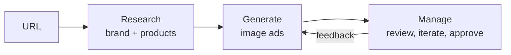

<!-- BEGIN:nextjs-agent-rules -->

# This is NOT the Next.js you know

This version has breaking changes — APIs, conventions, and file structure may all differ from your training data. Read the relevant guide in `node_modules/next/dist/docs/` (resolved from this file's directory; in monorepos the `next` package may not be visible from the repo root) before writing any code. Heed deprecation notices.

This block is written and re-added by `next dev` — verify at `node_modules/next/dist/server/lib/generate-agent-files.js`. Removing it from a diff only re-creates the uncommitted change; committing it with your work keeps the tree clean.

<!-- END:nextjs-agent-rules -->

## Context

You are on a team inside AppLovin building a new advertiser fewature. The user is a marketer at an ecommerce brand that has a store and product photos but no ad creatives yet. Use www.loopycases.com as the example store while you build. The product takes them from a URL to ads they would actually run.

We are testing product judgment, attention to detail, the ability to build autonomously, and business thinking. Working software that feels good matters more than breadth.

You own the product decisions. Where this brief is silent, decide, and explain why in your note.

## What to build

The core loop is research, generate, manage. Make it as agentic as you can: the agent does the work and the user steers.



1. **Onboard.** The user gives a company or product URL. The agent researches the brand (logo, colors, voice, value prop, audience) and pulls real product images and details from the store. Decide what you scrape, what you infer, and what you ask the user. Limiting it to Shopify stores is fine if that makes research easier; say so in your note.
2. **Generate.** Produce full-screen portrait image ads (9:16, portrait interstitials) built around the store's real product photos, never an invented product, with the headline and call to action rendered inside the image.
3. **Manage.** Persist the brand kit, campaigns, ads, variants, assets, and their status in Supabase. The user can give feedback, edit, regenerate, and approve.
4. **Human in the loop.** At least one point where the agent pauses for user input, and one where user feedback changes the next generation.

## Stack

The stack is fixed so we compare like with like. Product and architecture decisions inside it are yours.

| Layer | Use | Notes |
| --- | --- | --- |
| Framework | Next.js (App Router), React, Tailwind |  |
| Agent and chat UI | Vercel AI SDK + AI Elements | Streaming, tool calls, generative UI |
| Data, auth, files | Supabase (Postgres, Auth, Storage) | Auth is optional; a single demo user is fine |
| Image generation | fal.ai | Pick a model that takes a product photo as a reference and renders text well. Copy outputs into Supabase Storage; fal URLs are not durable |
| Research | Firecrawl (Brand Extractor) or a web search API (Exa, Tavily, Brave) |  |
| LLM | Any provider (Vercel AI Gateway recommended) |  |
| Hosting | Vercel |  |

## How it works

The Next.js App Router serves a React/Tailwind workspace and authenticated API routes. Chat uses the Vercel AI SDK `useChat` hook and a `ToolLoopAgent` concierge. Native tool activity streams while the server owns workflow rules and trusted history. The current UI is custom; AI Elements components are not yet integrated.

The four roles are modules, not independently running workers:

| Component | Responsibility |
| --- | --- |
| Concierge (`lib/workflow/agents/concierge.ts`) | Interprets requests, records preferences and invokes bounded, typed workflow tools. It has no human approval tool. |
| Researcher (`lib/workflow/agents/researcher.ts`, `lib/workflow/research/`) | Uses Firecrawl branding, markdown, HTML and links; extracts products/assets with provenance; synthesizes voice, audience and evidence-backed offers. Scope follows actual user direction. |
| Workflow (`lib/workflow/service.ts`) | Enforces grounding, revision invalidation, approval, execution plans, generation checkpoints, feedback and final approval. |
| Artist (`lib/workflow/agents/artist.ts`, `lib/workflow/creative/`) | Sends the pinned Shopify product photo to one Nano Banana Pro edit call to create the complete environment and product scene, then composes exact approved copy in code. |
| Reviewer (`lib/workflow/agents/reviewer.ts`) | Combines deterministic provenance/layout checks with a separate vision review. Saves advisory findings for the user's accept, edit or regenerate decision. |
| Persistence (`lib/supabase/server.ts`, `lib/workflow/sessions.ts`, `lib/workflow/storage.ts`) | Verifies identity, enforces ownership and campaign leases, commits versioned state and stores immutable image bytes. |

Research uses at most three pages for brand discovery, or eight attempts and three product pages for campaign research, within a three-minute retrieval budget. Shopify product data establishes gallery and variant-image ownership; there is no research-photo model. Successful retrieval is checkpointed before optional language-model synthesis. Failed pages produce warnings and retained partial results. Discovery is same-store and bounded; this is not a full catalog crawl. Product/asset IDs link a brief to saved evidence. Voice and audience are labeled inferences; observed sale text does not itself prove eligibility.

The artist generates images without the final headline/CTA, then renders the exact approved copy over the full-bleed scene. The overlay itself is transparent: the verified logo is fixed to the top-left, the headline stays at the top, and commercial copy plus the CTA sit at the bottom. Scene normalization fills the 9:16 canvas. Research retains detected heading and body font names as metadata only. Ad fitting and rendering always use the same bundled Geist font bytes; store fonts are not downloaded or cached. Emoji use bundled Twemoji SVGs. Unsupported glyphs and copy that cannot fit return actionable errors before generation.

The default image plan uses one paid fal call for a new ad. With a compatible saved scene, copy/style changes use **zero** image calls; any setting, subject, pose or composition change uses **one**. Explicit regeneration also uses one. These counts exclude language-model/reviewer calls; plans validate exact saved inputs and bytes before spending. See [artist verification](docs/artist-verification.md) for model settings and the distinction between mocked call-count tests and paid probes.

## Data and recovery

Exactly five application tables keep the ownership and creative history explicit:

| Table | Saved data |
| --- | --- |
| `brands` | Owner-specific store identity and current brand kit. |
| `research_snapshots` | Immutable, versioned source findings and user corrections. |
| `campaigns` | Current research/brief pointers, chat, preferences, events and lease/revision state. |
| `ad_versions` | Brief/design/copy, ancestry, approval/review status, generation and fixed stage checkpoints. |
| `assets` | Original product/logo, generated complete scene and final ad records with hashes and private object paths. Nullable legacy background fields remain in the database for now. |

Each API request verifies the caller through Supabase Auth. Browser roles have owner-scoped read policies; mutations use server-only RPCs. Privileged server reads also filter the verified owner. Campaign leases and increasing revisions reject concurrent or stale writes across server processes. The Supabase secret never reaches the browser.

Source images must be associated with the selected product by Shopify and pass download validation before capture. fal receives one fresh, short-lived signed URL for that pinned source. Provider results are copied into private Storage rather than served indefinitely from fal URLs. Preview and download use authenticated application routes backed by those durable bytes.

The paid scene stage records its attempt **before** calling the provider and its result **before** downloading. An ambiguous attempt cannot automatically submit another paid request. A saved provider result can be downloaded again; a saved scene can be reused and recomposed without repeating generation. Ready object paths are immutable, with hash checks for interrupted uploads. The final ad is persisted before review, so unavailable or critical review feedback still leaves the image available for the user's accept, edit or regenerate decision.

Disconnecting the browser does not deliberately cancel stream consumption, but this is not a durable job queue. If a worker dies before saving a provider result, or the recovery URL expires, operator inspection and a deliberately approved new version may be necessary. No fixture or local file silently substitutes for a failed production provider.

To inspect an older local demo before importing it, run the explicit **dry run**:

```sh
node --import tsx scripts/import-local.ts --owner DESTINATION_USER_UUID --directory /absolute/local-output
```

Use an existing destination identity. The [import instructions](docs/supabase-setup.md#importing-local-demos) describe `--apply`, conflicts and legacy provenance limits. Import never edits the source files or calls research/image providers. Legacy final images can remain viewable without being treated as reusable two-stage assets or as proof of the historical source photo.

## Verification and limits

```sh
npm test
npm run lint
npm run typecheck
npm run build -- --webpack
```

The test suite uses mocked providers and temporary/in-memory state; running it does not incur paid generation. It exercises approval and grounding rules, staged research, reference provenance, reuse plans, recovery, exact-copy rendering, ownership and persistence contracts. The integrated implementation passed 59 tests, lint and TypeScript checking on September 22, 2026. SQL and hosted-service checks are documented separately in [Supabase setup](docs/supabase-setup.md). Live Supabase checks passed for two-owner isolation, private bytes and signed URLs, reloads, final image/review/approval persistence, historical approvals, denied client mutations and repeated legacy imports. Those harnesses used synthetic data and made no paid provider calls.

The optimized production webpack build also passed. A local browser check against live Supabase completed Loopy homepage research, paused for campaign direction, and restored its brand kit and suggestions after a full reload. A fresh identity also created a campaign and delivered its first chat message exactly once. These checks caught and fixed Next.js internal-hostname origin validation and React Strict Mode first-message cancellation. They did not generate another image or verify a Vercel deployment.

[Research verification](docs/research-implementation.md) records homepage/product checks for Loopy Cases, BlendJet, Allbirds, Peak Design and Ugmonk. These checks establish extraction behavior, not five approved ad campaigns. [Artist verification](docs/artist-verification.md) records the earlier model comparison that motivated the single Nano path; current mocked reuse tests and diagnostic rendering are not deployed end-to-end verification.

The main limits are product fidelity, incomplete store markup and operational hardening. The extractor supports structured product/gallery/offer evidence, not every arbitrary DOM gallery; unresolved assets need user confirmation. Asset role suggestions do not establish product or variant ownership; grounding still requires saved product evidence or an explicit user correction. There is no browser fallback or invented customer evidence. Source bytes retain their original orientation/color metadata. Reference-conditioned generation and vision review cannot guarantee exact logos, tiny markings or physical details. Review findings need human inspection.

There is no durable job queue, global spending cap, cross-device anonymous account recovery or automatic cleanup. Research/provider calls are bounded and automatic LLM retries are disabled, but those controls do not replace production rate limits or spend monitoring. Local application checks and live Supabase verification are recorded above. Vercel deployment, hosted sign-in, Loopy brand research and reload persistence are verified in the [deployment record](docs/deployment.md). Hosted image generation and five complete live ad campaigns remain unverified; consult the linked records for the exact evidence.

Twemoji artwork is by Twitter and other contributors, distributed under [CC BY 4.0](https://creativecommons.org/licenses/by/4.0/); [source](https://github.com/jdecked/twemoji). SVG artwork is unchanged apart from display sizing.
