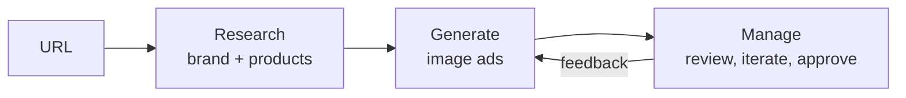

<!-- BEGIN:nextjs-agent-rules -->

# This is NOT the Next.js you know

This version has breaking changes — APIs, conventions, and file structure may all differ from your training data. Read the relevant guide in `node_modules/next/dist/docs/` (resolved from this file's directory; in monorepos the `next` package may not be visible from the repo root) before writing any code. Heed deprecation notices.

This block is written and re-added by `next dev` — verify at `node_modules/next/dist/server/lib/generate-agent-files.js`. Removing it from a diff only re-creates the uncommitted change; committing it with your work keeps the tree clean.

<!-- END:nextjs-agent-rules -->

## Context

You are on a team inside AppLovin building a new advertiser fewature. The user is a marketer at an ecommerce brand that has a store and product photos but no ad creatives yet. Use www.loopycases.com as the example store while you build. The product takes them from a URL to ads they would actually run.

We are testing product judgment, attention to detail, the ability to build autonomously, and business thinking. Working software that feels good matters more than breadth.

You own the product decisions. Where this brief is silent, decide, and explain why in your note.

## What to build

The core loop is research, generate, manage. Make it as agentic as you can: the agent does the work and the user steers.

1. **Onboard.** The user gives a company or product URL. The agent researches the brand (logo, colors, voice, value prop, audience) and pulls real product images and details from the store. Decide what you scrape, what you infer, and what you ask the user. Limiting it to Shopify stores is fine if that makes research easier; say so in your note.
2. **Generate.** Produce full-screen portrait image ads (9:16, portrait interstitials) built around the store's real product photos, never an invented product, with the headline and call to action rendered inside the image.
3. **Manage.** Persist the brand kit, campaigns, ads, variants, assets, and their status in Supabase. The user can give feedback, edit, regenerate, and approve.
4. **Human in the loop.** At least one point where the agent pauses for user input, and one where user feedback changes the next generation.

## Stack

The stack is fixed so we compare like with like. Product and architecture decisions inside it are yours.

| Layer | Use | Notes |
| --- | --- | --- |
| Framework | Next.js (App Router), React, Tailwind |  |
| Agent and chat UI | Vercel AI SDK + AI Elements | Streaming, tool calls, generative UI |
| Data, auth, files | Supabase (Postgres, Auth, Storage) | Auth is optional; a single demo user is fine |
| Image generation | fal.ai | Pick a model that takes a product photo as a reference and renders text well. Copy outputs into Supabase Storage; fal URLs are not durable |
| Research | Firecrawl (Brand Extractor) or a web search API (Exa, Tavily, Brave) |  |
| LLM | Any provider (Vercel AI Gateway recommended) |  |
| Hosting | Vercel |  |

## Deliverables and time box

Budget about 8 hours over one week.

Use AI coding tools freely, but stay in the loop. You need to explain every part of how it works, from how product images come off a store to how a finished ad lands in Storage. In the review we pick parts at random and ask how they work; an agent solving a problem for you that you cannot explain counts against you, not for you.

- GitHub repo link.
- Deployed URL on Vercel.
- A short note, written by you (not by an AI), on what you built and why.
- An architecture diagram drawn by you in Excalidraw, showing how the pieces fit: research, generation, storage, and the UI. Share the link or a PNG export.
- A Loom walkthrough in two parts. First, results from at least five ecommerce sites of your choice; pick sites that stress different things, like product photography, brand voice, and catalog size. Second, how you built it: how you worked with your coding agent, what you asked it to do, where you overrode it, and what you had to figure out yourself.

## How we evaluate

We score the deployed app first and the code second.

| Area | What great looks like |
| --- | --- |
| Product judgment | Sensible scrape vs infer vs ask; a good empty state; tool failures degrade gracefully instead of dead-ending |
| Attention to detail | Polished UI, legible on-image text, the product looks like the real one, images stored and served correctly, no loose ends |
| Autonomy and completeness | What you chose to build works end to end on the deployed URL |
| Engineering quality | Clear data model, sane server/client split, streaming done right |
| Creativity and business thinking | The open-ended feature and the reasoning in your note |

We’ll follow up with a 45 minute overview conversation. You walk us through the build, then we talk about improving it, shipping it to production, and what you would measure first.