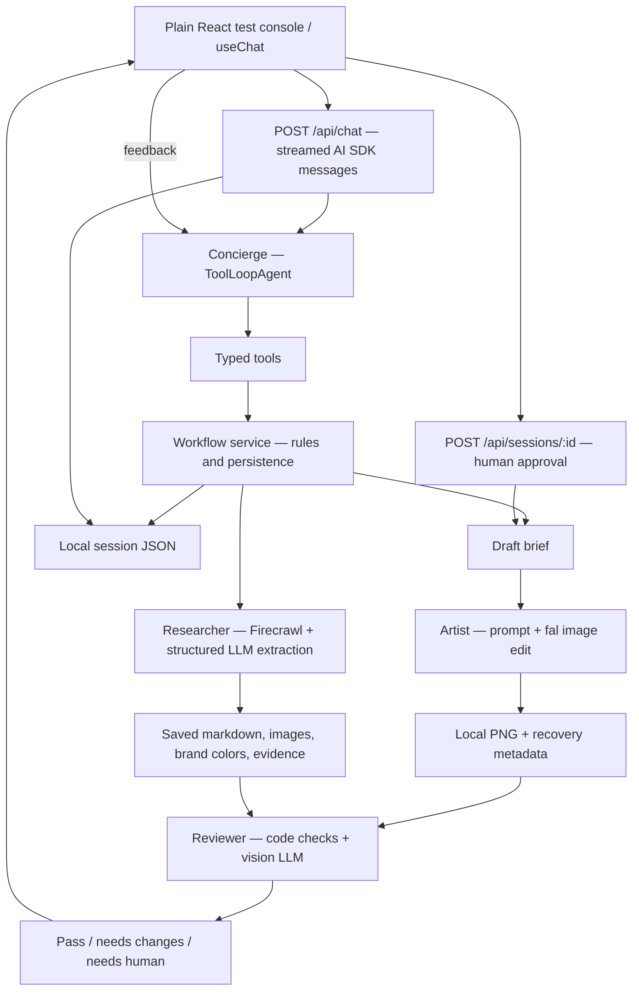

# Local agent workflow PoC

A small backend-first implementation of **research → approved brief → image → review → feedback**. The plain console exercises the workflow and exposes tool results and saved state. Everything is stored on disk; there is no Supabase integration.

## Run

```sh
npm install
npm run dev -- --hostname 127.0.0.1
```

Provide these values in `.env.local` (server only):

```dotenv
FIRECRAWL_API_KEY=...
FAL_AI_API_KEY=...
AI_GATEWAY_API_KEY=...
```

The existing `AI_GATEWAY_KEY` name is also supported, so existing local configuration works without renaming it. The code never sends keys to the browser. Optional settings:

```dotenv
CONCIERGE_MODEL=inclusionai/ling-3.0-flash-vl-free
RESEARCHER_MODEL=inclusionai/ling-3.0-flash-vl-free
REVIEWER_MODEL=inclusionai/ling-3.0-flash-vl-free
# WORKFLOW_DATA_DIR=/absolute/path/to/local-data
```

All three language roles default to **Ling 3.0 Flash VL Free through Vercel AI Gateway**. It is explicitly listed in the current Gateway catalog with $0 input/output pricing and accepts image input, so it can support the reviewer as well as the text-only roles. The artist retains **fal FLUX.2 klein 4B edit**, one 576 × 1024 PNG, four steps; fal is a separate paid provider. These defaults prioritize testing cost over creative/evaluation quality. Models can be changed per role without changing the workflow. A replacement reviewer must support images and structured output; changing the fal model also requires updating its model-specific request in `fal.ts`.

## Try the flow

1. Click **New session** and send `Research https://www.loopycases.com and draft an ad.` Add a specific product URL and/or campaign URL when available. The researcher reads only the supplied URLs; it does not crawl an entire catalog.
2. Inspect the colors, inferred voice/audience, and source-backed sale quotes. Select the actual product photo in the brief, edit headline/CTA/direction if needed, and **Save revised brief**.
3. Click **Approve brief and photo**, then **Generate approved brief**. Approval alone incurs no generation call. The Generate button calls the workflow directly with the approved brief ID, without another concierge model request. Chat can also request generation through the native `generateAd` tool.
4. The artist saves the PNG locally, then the reviewer compares it with the product photo and source text. Inspect the verdict and per-criterion explanations. A review pass still requires **Approve ad** from the user.
5. Click **Give feedback** on an output and describe a change, such as `Use a cream background and less copy.` The concierge creates a new brief with feedback and a parent variant ID. Approve that revision before generating again.
6. Reload the page and choose **Resume a saved session** to restore chat, preferences, research, brief, and variants.

A failed review can be retried without generating another image. A failed or timed-out image request cannot automatically retry: inspect the events and any recovery JSON, then deliberately draft and approve a new revision if appropriate.

## Architecture and responsibilities



The four roles are separate modules, not four continuously running processes. The concierge uses the AI SDK's built-in tool loop. Research and review are focused structured-output LLM calls. The artist is a deterministic prompt builder plus fal adapter; an extra LLM planning call is unnecessary for this baseline.

Research and review obtain their structured results through a required `submitResult` tool and Zod validation. The free Gateway model rejects native JSON-schema response formatting, so neither agent uses that provider feature. Optional research URLs accept missing, empty, or null values; bare domains get HTTPS and Markdown-wrapped URLs are normalized before execution. Absent sale/parent IDs accept JSON null, the strings "null"/"none", or blank values. Real IDs still must exist in this session. `parentVariantId` is null for the first ad and references the earlier generated ad when iterating. Saved legacy `rawInput` message fields are migrated to `input` when loaded and saved.

| File | Responsibility |
| --- | --- |
| `lib/workflow/agents/concierge.ts` | Short concierge prompt, five typed tools, bounded agent loop, compact state/context. Tools within one turn execute serially. |
| `lib/workflow/agents/researcher.ts` | Scrape up to three supplied URLs; infer voice/audience; extract sales; drop sales whose quoted evidence is missing. |
| `lib/workflow/agents/artist.ts` | Build the ad prompt from approved copy, colors, preferences, sale evidence, and iteration feedback; invoke fal and save the result. |
| `lib/workflow/agents/reviewer.ts` | Deterministic checks plus a separate vision call comparing original photo, generated PNG, brief, and saved source evidence. |
| `lib/workflow/service.ts` | Provider-independent workflow operations: research, revisions, approval, generation, review, preferences, and ad approval. Dependencies can be substituted in tests. |
| `lib/workflow/schema.ts` | Zod contracts for tools, research findings, briefs and visual evaluations. |
| `lib/workflow/session-types.ts` | Session, source, research, brief, variant, review and event types. |
| `lib/workflow/models.ts` | Gateway credentials and per-role model selection. |
| `lib/workflow/firecrawl.ts` | Firecrawl v2 HTTP adapter for markdown, image URLs, and branding colors. |
| `lib/workflow/fal.ts` | Existing low-cost image-edit model and model-specific request settings. |
| `lib/workflow/storage.ts` | Download fal output into local storage; serve saved images by UUID. |
| `lib/workflow/sessions.ts` | Atomic JSON writes, history loading/listing, and one active request per session in one server process. |
| `app/api/chat/route.ts` | Load trusted server history, accept a text-only user message, stream the concierge, save the completed conversation. |
| `app/api/sessions/` | Create/list/load sessions and explicit human actions. The agent has no approval tool. |
| `app/workflow-console.tsx` | Minimal chat, source/photo inspection, brief editing/approval, variant review, and debug output. |

The previous standalone `/api/scrape` and `/api/generate` routes have been replaced by workflow tools so image generation follows the approval rules. The existing Firecrawl/fal adapters and output endpoint remain in use. AI Elements styling/components are deferred; the test console uses the AI SDK React hook directly.

## What is scraped, inferred, and confirmed

- **Scraped:** markdown, metadata, image URLs, Firecrawl branding colors, page URL and fetch timestamp. Announcement bars are included (`onlyMainContent: false`); fresh reads are requested (`maxAge: 0`) for sale evidence. Branding runs only on the first supplied page.
- **Inferred:** voice and audience, explicitly labeled as inferences. Unknown is acceptable.
- **Evidence-backed:** sales include an exact source excerpt and URL. A code check rejects unmatched excerpts. That proves the quote occurred, not that an offer is applicable or still active. The visual reviewer checks copy, restrictions and unsupported claims against saved text.
- **Confirmed by the user:** actual product photo, final brief/copy, selected offer and final ad approval. A homepage can contain logos and banners; the user must choose the intended real product. If it is absent, provide a direct product URL.

## State, approvals, and failure behavior

`local-output/sessions/<session-id>.json` contains chat (including tool activity), per-session preferences, current research/brief, variants, and timestamped operation events. Each variant keeps its own brief and research snapshot, so later changes do not change what an old image was evaluated against.

`local-output/<generation-id>.png` is the saved output, served by `/api/outputs/<generation-id>`. The accompanying `.json` stores the prompt, model, source photo/page, timestamp, seed when available, and temporary provider URL for recovery. The metadata is saved before download; if download fails, its recovery URL remains available. Source photo URLs are persisted, but source photo bytes are not copied locally yet.

- Draft edits and new preferences revoke pending approval. New research removes the current brief.
- Approval is tied to the current brief ID. Client-supplied approval fields are stripped by schema validation.
- A generation-attempt marker is persisted **before** calling fal. Repeated calls for an already completed revision return the existing variant; uncertain/failed requests cannot retry automatically.
- A generated image/variant is persisted **before** review. Review failure sets `review_failed` and preserves the output.
- Review combines PNG aspect ratio, photo provenance, brief approval, sale evidence, and vision criteria: product fidelity, text/CTA legibility, claim accuracy, brand fit. `fail` → `needs_changes`; uncertainty → `needs_human`; all pass → `reviewed`. Only reviewed outputs can be approved in this baseline; there is no override flow yet.
- Reviewer findings never trigger automatic regeneration. Feedback goes into the next approved brief and prompt; iterations use the original product photo, not the previous generated pixels.
- Stream consumption continues after a browser disconnect so local results can finish saving. Reload/resume to inspect them. This is not a durable background-job system.

## Cost controls and current limits

Five concierge steps maximum per turn; one research/brief/generation/review tool attempt of each kind per turn; zero automatic LLM retries; one image per approved revision; at most three scraped pages; bounded source excerpts and recent chat context; 2,200 output tokens per LLM call. After a tool execution fails or a brief is saved, the agent loop ends immediately and the server supplies the error or approval instructions. No extra model call is made to explain that boundary. Concierge prose is buffered until the turn ends; native tool events still stream immediately. Printed XML tool-call tags are replaced with an explicit failure notice and never executed. Full chat remains on disk; the last 12 messages plus current state and saved preferences are supplied to the concierge. Explicit preferences persist per session, not across separate sessions.

This is a **single-user, single-process local PoC**. There is no authentication, rate limiting, distributed locking, durable job queue, global spending cap, Supabase, or deployment setup. Run on loopback. Local disk is not suitable for durable Vercel storage; replace the storage modules and request execution model before deployment. Source content and vision checks reduce hallucinations but cannot guarantee exact product preservation or deal validity.

## Verification

```sh
npm test
npm run lint
npm run typecheck
npm run build -- --webpack
```

Tests run offline with fake providers and temporary storage. They cover approval enforcement/revision invalidation, reference provenance, sale evidence, duplicate-generation prevention, feedback/ancestry, review failure and retry, code/visual verdicts, persistence, concurrent-turn rejection, and provider request/PNG contracts. They do not establish live model quality.

The streaming integration test uses the real AI SDK agent/tool loop with a mock model: research → draft → pause → explicit approval → generate/review → streamed response and saved history. There is no charge for running the test suite.

Verified during implementation:

- 19 offline tests pass; lint, TypeScript and the webpack production build pass. Regressions cover blank optional URLs, bare domains, Markdown URLs, string null IDs, unique source-asset resolution, stopping after failed tools and saved drafts, blocking unapproved generation, rejecting stale brief IDs, split XML tool tags, legacy message migration, and structured results through function tools.
- The local browser console loads, creates sessions, streams provider errors and remains usable afterward.
- One real Firecrawl branding scrape of Loopy Cases succeeded: source text, 60 image candidates and branding colors. Its independent smoke artifact is ignored at `local-output/smoke-source.json`.
- A real Gateway request to the default free model succeeded, including one AI SDK tool call. No new fal generation was attempted during this implementation; its request and local-save contracts were exercised with mocked responses.
