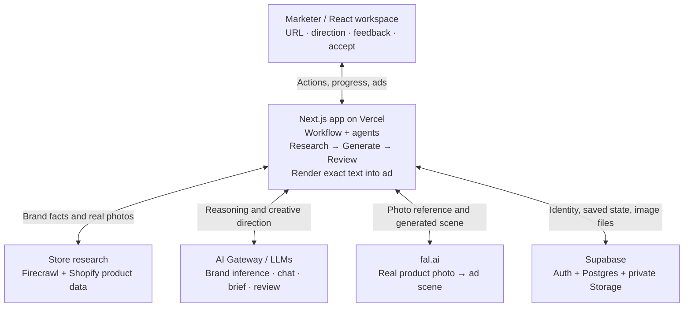

# Simple architecture diagram

Use this one diagram for the Excalidraw version: **six boxes and five connections**. It shows system boundaries; research, generation, and review are responsibilities inside the Next.js app, not separate services.

Put the marketer at the top, the app in the middle, and the four external boxes below it. Bidirectional arrows mean requests and responses, not that those providers initiate work. Vercel is the intended hosting target; this diagram is not deployment verification.

## A short explanation to practice

“The marketer gives the Next.js app a store URL. Firecrawl researches the brand, and Shopify product data gives us real products and their photos. The user chooses a campaign direction, then the app uses language models to plan the creative. fal generates a scene using a saved product photo, and our renderer adds the exact headline and CTA. Supabase stores the research, creative versions, and image files. Automated review gives feedback, and the marketer can accept the ad or request a new version.”

Three details to mention verbally rather than drawing more boxes:

- The app pauses for campaign direction; Generate can authorize planning and generation together.
- Copy-only edits can reuse a saved scene. Visual changes generate a new scene.
- Final images are copied into private Supabase Storage, so the app does not rely on temporary fal URLs.

See [the architecture walkthrough](architecture.md) for the underlying implementation and limitations.
