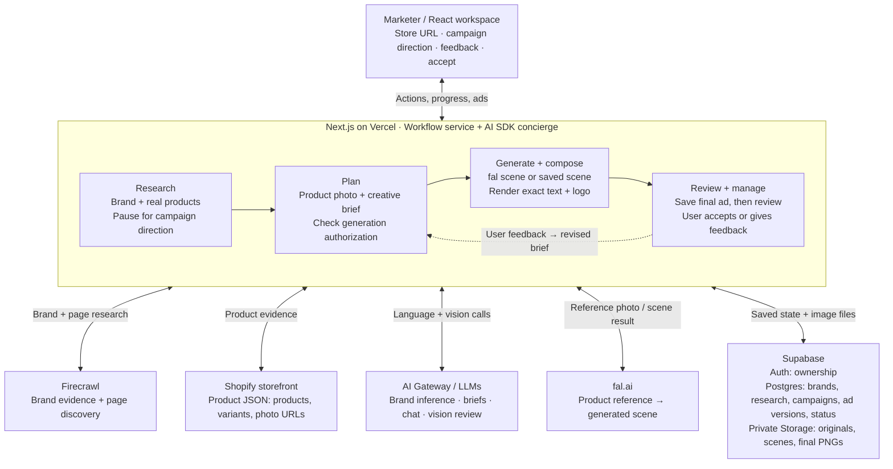

# Simple architecture diagram

Use this as a **one-page drawing guide for your own Excalidraw diagram**: one workflow row, one feedback loop, and separate, clearly labeled external dependencies. Internal steps are modules in the same application, not separate services. Keep the dependencies visible while connecting them only to the app boundary.

## How to lay it out in Excalidraw

- Put the **workspace at the top** and the **Next.js boundary in the middle**. Put **Firecrawl and Shopify on the left**, **AI Gateway and fal.ai on the right**, and **Supabase underneath**.
- Inside Next.js, draw just four boxes in a row: **Research → Plan → Generate + compose → Review + manage**. Put “Workflow service + AI SDK concierge” in the boundary title instead of adding another box.
- Give each external dependency **one connection to the app boundary**, never to individual steps. Keep those connections outside the workflow row. Firecrawl retrieves brand/page evidence; Shopify provides structured catalog evidence; AI Gateway provides language and vision models; fal generates scenes. These are separate boxes so their responsibilities remain explicit without a model-to-agent arrow network.
- Keep **one dashed feedback arrow**, from Review back to Plan. It means a user-requested revision, not automatic regeneration after a model review.
- Write the human pause inside Research and the acceptance decision inside Review. Generate can authorize planning and generation together; not every initial brief gets a separate manual review.
- Inside Supabase, use three text sections for **Auth, Postgres, and Storage**. Add a small note under Generate: **“Copy-only edits can reuse the scene.”**

Bidirectional provider arrows mean requests and responses, not that providers initiate the workflow. The browser receives progress through saved-state polling and chat tool streaming; previews/downloads read saved image bytes through authenticated API routes. Vercel is the intended hosting target, not a claim that deployment has been verified.

## Image path to put beneath the diagram

**Store photo → pinned original in Storage → fal scene → exact text/logo renderer → final PNG in Storage**

The app validates and downloads the source photo before generation. It gives fal a temporary signed URL to that saved original, downloads fal's result, and saves the scene before composition. Both the scene and final ad are durable private assets; the workspace does not depend on temporary fal URLs. Reference-conditioned generation can still alter product details, so review compares the final ad with the original photo.

## One operational footnote

**Request-driven workflow with saved checkpoints; no durable background queue.** Campaign stages advance through browser continuation requests. Saved state supports recovery, but a terminated server process does not keep working. Leave campaign leases, revision checks, and detailed recovery rules for the verbal walkthrough.

## A short explanation to practice

“The marketer gives the app a store URL. Firecrawl retrieves brand evidence, then the app pauses for campaign direction. Shopify product data grounds the selected products and their photos. The workflow saves a creative brief and checks authorization before generating. fal creates a scene using a saved product photo; our renderer adds the exact headline, CTA, and logo. We save the finished image before automated review, so review failure does not hide the ad. The marketer accepts it or gives feedback that creates a new version. Copy-only changes can reuse the saved scene. Supabase keeps the state and version history in Postgres, and original photos, scenes, and finished ads in private Storage.”

See [the architecture walkthrough](architecture.md) for the underlying implementation and limitations.
