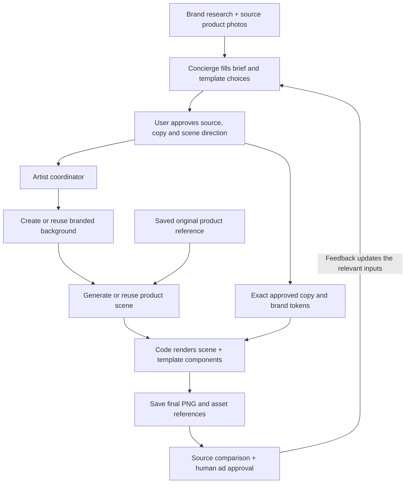

# Artist workflow — generated scenes with template composition

Status: design and implementation plan only. This is not the take-home's author-written submission note or personal architecture deliverable.

## Product goal

**Generated product scenes are the required end state and the default customer experience.** Given brand information and real source photos, the artist creates a branded environment, renders the referenced product in that setting, and combines the resulting scene with exact template-rendered copy.

Source-photo compositing is an internal debugging/testing path. It helps validate layout, text, storage, and review with a known product image. Completing that path alone does not complete this project. Do not expose it as a competing customer mode or silently fall back to it when generation fails.

Keep one artist coordinator with focused modules. The existing concierge fills the brief; background and scene generation are bounded image-provider calls; code composes the final ad. Additional autonomous design agents or planning calls are unnecessary.

## Current foundation

- The concierge already fills structured briefs, chooses template styles, and pauses for approval.
- The artist already generates a product scene from a source image, saves it, and calls the renderer. The environment and product are currently generated in one request.
- The creative modules already provide two templates, exact copy, font fitting, and a 576 × 1024 PNG using ImageResponse.
- The workflow supports whole-visual reuse, approval, saved-visual checkpoints, variant ancestry, and review.
- The README records product texture/loop uncertainty in a previous live Loopy Cases test. Generated-scene fidelity needs direct evaluation; reliable typography alone does not establish a successful ad.
- Persistence is local JSON/PNG. Source photos are referenced by URL, not saved bytes. Supabase remains necessary for durable deployed storage.

Extend this foundation with an independently directed background step and a product-focused scene step. Preserve the deterministic final renderer.

## Responsibilities and flow

| Responsibility | Owner | Output |
| --- | --- | --- |
| Creative direction and content | Existing concierge | Approved template, copy, environment direction, product scene direction |
| Background | createBackground | Saved branded environment without the advertised product or ad text |
| Product in context | createScene | Saved scene integrating the original product reference into that environment |
| Template filling and overlay | Existing components and renderer | Exact headline, CTA, offer, and verified logo in the final PNG |
| Coordination | Existing artist and workflow service | Validation, reuse, checkpoints, persistence, review |



Select the template before image generation. Its canvas and reserved regions constrain both image stages. Background generation precedes scene generation because the latter consumes its output. Copy is prepared before approval and rendered after the scene; it needs no additional agent call.

**Separate responsibilities do not require every final visual element to remain a separate transparent layer.** For a product being held or used, contact, lighting, perspective, and occlusion must agree. The scene module produces a coherent image of product and environment together. The saved background remains an input and reusable checkpoint; it is not guaranteed to remain pixel-identical after scene generation.

## 1. Source reference and debugging baseline

Save the selected source bytes when preparing the brief, before approval, and pin the asset to that revision. Normalize orientation/color consistently and retain the original. Generation and review use this snapshot so changes to the store URL cannot silently change the approved product. Restrict fetching to validated research assets with image type and size limits.

Every scene generation receives the original product reference. Never use a prior generated scene as the sole product reference: successive edits must not gradually redefine what the product looks like. Supporting additional verified views of the same product can follow if a scene needs evidence absent from the selected photo.

For the internal test harness, use the complete source photo or an already-prepared cutout fixture on a saved background. Feed it through the same renderer, storage, and review interfaces as a generated scene. This isolates typography/layout bugs from generation failures and provides a source-preserving comparison.

Keep the harness in tests/scripts or an explicitly marked developer control, outside the customer brief schema. Do not build a background-removal service or product-treatment UI just to establish this baseline. Mark fixture assets so they cannot be mistaken for production generated scenes.

## 2. Background creation

createBackground consumes the approved environment direction, visual palette, canvas size, and template geometry. Produce a 576 × 1024 background with room for the product and the template's copy region.

Start with simple branded settings, then include plausible lifestyle settings needed for the intended ad. Generate the environment without the advertised product, headline, CTA, prices, logos, or buttons. Keep raw conversation history out of the image prompt.

A useful responsibility split is:
- Background direction: “Warm cream bathroom counter, soft daylight.”
- Scene direction: “The referenced case is held naturally, with its printed back and loop clearly visible.”

People, hands, and interaction that must align with the product belong to the scene step. The background step establishes surroundings and general lighting.

Evaluate the text-to-image endpoint fal-ai/flux-2/klein/4b for this step. Its documented API accepts a prompt and custom dimensions. Verify the actual response in an implementation smoke test and keep provider settings inside fal.ts. [fal background generation API](https://fal.ai/models/fal-ai/flux-2/klein/4b/api).

Save the background before starting the scene request. Reuse it when environment inputs remain unchanged. A provider failure preserves progress and surfaces the failed step; it does not silently change the approved creative.

## 3. Product-focused scene generation

createScene consumes the saved background, saved original product reference, approved scene direction, and code-owned template geometry. Its responsibility is to make the product the focal point while integrating it naturally into the setting.

Use a reference-capable edit request with explicit image roles: the product reference defines product identity; the background defines the environment. Keep both references in every fresh scene request. Require preservation of identifiable shape, color, pattern, proportions, openings, and existing product markings. Generate no advertising text or new logos.

The existing fal-ai/flux-2/klein/4b/edit endpoint documents multiple image inputs, so begin by adapting the current single-reference wrapper to pass the product and background. This establishes API feasibility, not fidelity quality; validate with real scenes before committing to the model. [fal edit API](https://fal.ai/models/fal-ai/flux-2/klein/4b/edit/api).

The output is a full-canvas scene with the product in the template's visual region. Do not run another generative pass after adding template text. Save the scene before composition.

For Loopy Cases, evaluate both a simple product setting and a hand-held usage scene. Inspect the loop, camera openings, print, color, and contour against the source. Natural contact may occlude some surfaces, but defining product details must remain sufficiently visible to assess identity. When the reference cannot substantiate a requested view, simplify the direction or select a suitable source in a new brief. Review uncertainty is not a fidelity pass.

Do not promise exact replication. The reference, constrained task, explicit product checks, and human approval reduce errors; the generated result still needs inspection.

## 4. Template components and placement

Keep copy-top and photo-top and shared Headline, CTA, OfferTerms, and optional verified Logo. The renderer receives a completed SceneVisual and places the template copy panel over it.

Keep the existing 448-pixel copy region and 576-pixel visual region initially. The template owns padding, sizes, alignment choices, and safe regions. Pass this geometry to both generation stages. An opaque brand-colored panel makes copy legible over generated imagery.

Code can guarantee the placement and fit of text. It cannot guarantee the model placed the photographed product correctly: visual review must check that the product is prominent, identifiable, and outside the covered copy region. If a generated product intrudes under the panel, revise the scene; do not hide the failure by cropping important details.

Render exact approved copy and complete evidenced offer conditions, validating fit before provider calls. Keep the bundled font and verified logo support. The concierge selects enums and fills content; it does not author JSX, CSS, coordinates, font URLs, or arbitrary component trees.

Keep ImageResponse for final composition. The installed Next.js docs support nested images and absolute positioning. Validate the new composition with fixtures first. Preview and download use the same saved PNG.

## 5. Small contracts

Keep copy, sale ID, product reference, feedback, and parent variant ID in the existing brief. The customer design contract always describes a generated scene:

```ts
type DesignSpecV2 = {
  version: 2;
  template: "copy-top" | "photo-top";
  alignment: "left" | "center";
  headlineStyle: "standard" | "oversized";
  ctaStyle: "solid" | "outline";
  background: { direction: string };
  scene: {
    direction: string;
    productScale: "standard" | "large";
  };
};
```

Use the existing approved brand-token snapshot. The template resolves geometry in code. There is no customer-facing cutout/generated mode switch.

Replace reuseVisualFromVariantId in new briefs with server-computed reuse. Compare exact inputs with the selected parent, save the execution plan with the revision, and show it before approval. An explicit “Another scene” request bypasses scene reuse; “Another background” bypasses background reuse and also requires a new scene. Record these requests on the brief revision.

Use small asset records for source, background, scene, and final output, containing immutable locations, dimensions, provenance, input fingerprints, and applicable provider/model/prompt/seed metadata. Asset IDs and checkpoints remain server-owned. Final variants reference the approved brief/tokens, background and scene assets, and renderer version.

## 6. Revisions and reuse

| Feedback | Background | Scene | Final composition |
| --- | --- | --- | --- |
| Change headline, CTA, or offer | Reuse | Reuse | Re-render and review |
| Change text alignment or CTA style within the same geometry | Reuse | Reuse | Re-render and review |
| “Make the product larger” | Reuse if environment remains compatible | Regenerate using original product reference | Re-render and review |
| Change product pose or interaction | Reuse if compatible | Regenerate | Re-render and review |
| Change environment, visual palette, or background variation | Regenerate | Regenerate against the new background | Re-render and review |
| Select a different product photo | Reuse if environment remains compatible | Regenerate using the new source | Re-render and review |
| Switch template and move the reserved product/copy regions | Regenerate if geometry changes | Regenerate for the new geometry | Re-render and review |
| Request another scene with identical direction | Reuse | Explicit fresh generation | Re-render and review |

A generated scene contains product and environment together. Changing the environment therefore invalidates the scene, and changing product scale is a scene-generation change rather than a cheap independent layer resize.

Background reuse depends on environment direction, visual palette, geometry, model/settings, and prompt version. Scene reuse additionally depends on the exact background asset, original source content, scene direction, product scale, and scene model/settings/prompt version. Copy is excluded from both keys.

Validate provenance against current research and session separately. Matching URLs do not prove matching source bytes. Initially search only the selected parent and current checkpoints. If an approved reuse asset is missing, stop rather than silently spend on replacement generation.

## 7. Persistence, recovery, and review

Replace the single visual checkpoint with two fixed checkpoints: background and scene. Record pending/attempted/saved status, saved asset ID, and provider recovery metadata inside the existing workflow service.

- Validate approval, source, copy fit, and reuse before paid work. Persist each provider attempt before dispatch.
- Save provider response metadata, download output, and persist its checkpoint before continuing.
- Keep the background if scene generation fails; keep the scene if composition fails. Resume saved steps without repeating successful paid requests.
- An attempted request without a saved result is uncertain. Preserve the current no-automatic-retry rule; expose recovery or an explicitly approved new attempt.
- Use a stable final output ID per brief. Persist final image and variant before review; review failure supports review-only retry.

Review the final PNG against the saved original source and evidence. Code checks cover provenance, approved references, dimensions, copy fit, and renderer inputs. Vision checks cover product fidelity/prominence, occlusion, interaction plausibility, text legibility, claims, and brand fit. Keep current verdicts and human approval rules. Failures lead to a revised brief, not an automatic retry loop or silent debug-mode fallback.

For development, extend the existing storage functions. For deployment, source/background/scene/final bytes belong in Supabase Storage and metadata, briefs, checkpoints, and variant references in Postgres. Store durable object keys rather than provider or expiring signed URLs. Use a database-guarded attempt transition before paid dispatch; the current in-memory lock only protects one local process. This remains the artist workflow's dependency on the broader Supabase migration.

## 8. UI and implementation sequence

Customer controls cover copy/template, environment direction, and product scene direction. Show the source beside the final result for fidelity inspection. Before approval summarize the work, such as **“Reuse background · generate new product scene · render ad.”** Keep approval before generation and final human ad approval.

Expose Edit copy, Change setting, Adjust product scene, and Choose source photo through the existing brief flow. Scene generation is the normal workflow; debug composition belongs in development tooling.

| Step | Work | Completion check |
| --- | --- | --- |
| 1. Define shared contracts | Update schema, geometry, asset types, and renderer input | Every stage agrees on references, dimensions, and safe regions |
| 2. Establish debug baseline | Render original-photo/cutout fixtures through the real template pipeline | Text, layout, and saved PNGs are independently verifiable |
| 3. Implement generated scenes | Add creative/background.ts and creative/scene.ts; extend fal.ts | A branded environment plus original reference produces a credible product scene |
| 4. Connect workflow and recovery | Extend artist, service, storage, and reuse | Both provider stages checkpoint; revisions regenerate only dependencies |
| 5. Add steering and fidelity review | Update concierge, editor, console, and reviewer | User feedback changes the next generation and outputs require approval |
| 6. Validate the target experience | Live examples and copy/scene/environment revisions | Generated usage scenes meet the acceptance checks below |

Generated-scene feasibility is tested early in step 3, before polishing a full debugging product. The project is incomplete until the generated-scene path works end to end. Source-photo fixtures remain regression tools throughout implementation.

Keep only two new production creative modules: background.ts and scene.ts. Reuse existing orchestration, copy fitting, renderer, and persistence boundaries. Version the new design/renderer; old outputs remain viewable, but old drafts become new unapproved revisions. Do not silently carry old approvals/checkpoints into the new two-stage plan.

## Acceptance checks

- The default approved request runs background generation and product scene generation, then produces a saved 576 × 1024 ad with exact template-rendered copy.
- Every scene request uses the saved original product reference and approved background; no request relies solely on a previous generated product.
- Demonstrate both a simple setting and a generated in-use scene. For Loopy Cases, inspect loop, print, contour, camera openings, and realistic hand/product contact.
- Copy-only revisions make zero image-provider calls. Scene-only revisions reuse background bytes. Background changes regenerate the dependent scene.
- Template geometry changes invalidate incompatible assets. Missing reused bytes, invalid provenance, and overflowing copy fail before unexpected spending.
- Reload recovery after either saved image stage, composition failure, or review failure never repeats successful paid work. Completed briefs return their existing variants.
- Preview/download show the same PNG. Human review confirms product identity, prominence, visible defining details, readable copy, and plausible scene integration.
- Debug fixtures remain labeled and cannot satisfy the production generated-scene completion checks.
- During implementation run tests, lint, typecheck, and build. Record live call counts for a first ad, copy-only revision, scene revision, and environment revision. Include deployed persistence verification when Supabase lands.

Defer freeform layout editing, arbitrary layer stacks, additional autonomous design agents, batch generation, automatic optimization, and specialized relighting/masking infrastructure. Generated scenes are part of the required scope.
