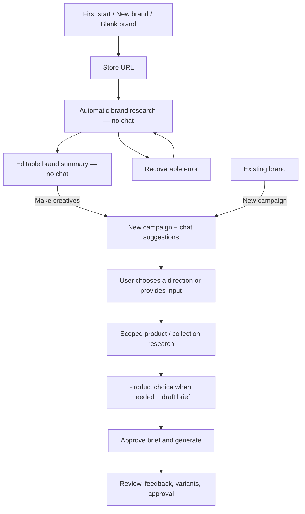

# Onboarding and creative-start refactor

Implementation handoff based on the user's confirmed decisions. This is a plan, not an implementation or the author's submission note.

**Implementation scope update:** The user confirmed this is a play project and legacy compatibility/backfill is unnecessary. Preserve existing rows, but skip the compatibility migration described below. See `onboarding-implementation.md` for the implemented scope and verification.

## 1. Product contract

Separate learning about a brand from deciding what to advertise.

- First start, a new brand, or a blank brand requires the store's base URL.
- Research runs automatically, with friendly progress and recovery controls. No chat, chat toggle, composer, resizing handle, or raw tool logs appear during onboarding.
- Initial research collects branding, positioning, voice, audience, and high-level product/collection links. Detailed product research waits for campaign direction.
- Completed research opens an editable brand summary. Corrections are optional; there is no additional mandatory approval screen.
- **Make creatives** starts the first campaign and opens chat. The creative partner suggests grounded directions, accepts freeform input, and researches the chosen campaign in more detail.
- **New brand** starts URL onboarding. **New campaign** reuses the selected brand and opens a fresh creative conversation directly.
- Choosing a direction permits scoped research. Image generation still requires approval of the exact brief and product photo.

## 2. Current implementation and reuse

| Area | Current behavior | Required change |
| --- | --- | --- |
| `app/workflow-console.tsx` | Chat starts open; blank sessions can submit arbitrary chat; boot loads the latest campaign | Separate setup and campaign views; select brands and campaigns explicitly |
| `components/workspace/research.tsx` | URL form sends a synthetic chat prompt; research view combines brand summary and campaign direction | Dedicated setup/summary components; direction selection moves into the creative conversation |
| `components/workspace/chat.tsx` | Always shows a static introduction asking for a URL | Campaign-aware opening with saved suggestions and no repeated onboarding intro |
| `lib/workflow/agents/researcher.ts` | Already has bounded brand and campaign stages | Reuse these; make brand-only scope explicit and avoid product-photo classification during onboarding |
| `lib/workflow/service.ts` | Research, corrections, briefing and generation share a workflow | Add explicit setup/start operations; preserve server-enforced direction and approval rules |
| `lib/workflow/sessions.ts` | Sessions are backed by campaigns; brands are attached when research is saved | Expose brand identity, setup purpose and lifecycle; support brand-scoped campaign creation |
| `lib/workflow/research/brand-context.ts` | Can strip campaign-specific data from saved research | Reuse for fresh campaigns, with a fresh immutable snapshot ID |
| Supabase migrations | Brands and shared kits already exist; snapshots and assets are owner-scoped | Extend these entities and RPCs rather than add a second storage system |

Preserve current authentication, same-origin mutation checks, leases, source validation, Storage behavior, immutable variant history and generation approval rules.

The working tree contains ongoing research/UI changes. Read the current files before implementing; do not reset them or substitute older versions from HEAD. Read relevant bundled Next.js and AI SDK docs before writing framework code. Consult the repository Firecrawl skills before changing provider integration.

## 3. Screens and interaction details

### Store URL

Show a focused full-width setup view within the workspace shell. Brand/Ads/Assets content must not provide a route around setup; navigation to other saved brands remains available.

- Heading: “Get to know your brand.” Input: “Store URL.” CTA: “Research brand.” Keep the Loopy Cases example.
- Accept a bare hostname by adding HTTPS. Normalize paths, query strings and fragments to the store root; show the normalized URL before submission. A pasted product URL does not authorize product research at this stage.
- Preserve meaningful store subdomains; reuse the existing hostname identity rules. Keep the existing remote-fetch validation and redirect boundaries.
- A URL already associated with this owner's ready brand opens that brand's summary. Do not automatically rescrape or create a duplicate brand. An incomplete setup resumes its existing record.
- A saved blank session must land here even if it has old chat messages. Existing substantive campaigns remain accessible under the compatibility rules below.

### Automatic research

Show a store identity and a compact progress indicator, using actual saved stages such as “Reading your store,” “Understanding your brand,” and “Saving your brand kit.” No fake percentage or technical trace.

- Read the homepage with branding extraction plus at most two relevant company/about pages, using the existing brand-stage budget.
- Save observed logo candidates, semantic colors, typography, positioning evidence, and navigation links. Label synthesized positioning, voice and audience as inferred unless explicitly observed or user supplied.
- Discover product/collection links from the pages already fetched. Do not crawl their destinations, load catalogs, verify product galleries, or run product-image vision classification during this step.
- Retain a bounded useful set of links separately from the two or three recommended directions. Do not throw away all but the first three navigation links before deciding what to recommend.
- Generate short suggested directions grounded in those observed links and brand findings. Validate any model-selected link IDs against saved observations. Claims such as “bestseller” or “on sale” need evidence. A deterministic link-based fallback is sufficient when synthesis is unavailable.
- Persist checkpoints for recovery, but only expose the summary as ready after the run reaches a terminal successful/usable-partial outcome.
- Missing logo, voice inference or other optional fields does not block a usable brand. Show concise missing-field notices in the summary. If no usable store source was retrieved, stay in setup with Retry and Edit URL.
- Poll persisted progress while research is active, independently of chat status. On reload, inspect the saved operation and lease before enabling Retry. Never automatically replay a paid scrape because a component mounted or a request disconnected.
- Keep execution inside an awaited, bounded server request. Do not return success and leave untracked work running. If the server execution is interrupted, show saved findings and explicit recovery; do not promise a durable background job.

### Editable brand summary

Show the brand name, store URL, logo, palette, positioning, voice, audience, and discovered product/collection links. Use small provenance labels: Observed, Inferred, Edited by you.

- Edit name, positioning, voice and audience. Allow palette corrections and choosing among observed logo candidates, including no logo. Typography and source links can remain read-only in this refactor; uploads/custom fonts are separate work.
- Use an explicit Save/Cancel edit mode. **Make creatives** is enabled only when the summary is usable and there are no unsaved edits or mutations in flight. A save failure retains the user's draft.
- Preserve the scraped observations; store validated user overrides separately and resolve them consistently in the summary, concierge context and render tokens.
- Corrections are brand-wide for future campaigns. Existing campaigns keep their saved research snapshot; their finished variants must never change retroactively. If an existing campaign adopts newer brand settings, do it explicitly and invalidate its pending brief approval.
- The primary action is **Make creatives**. Secondary access to details/sources is fine; this screen should not require the user to choose campaign direction yet.

### Creative conversation

The first **Make creatives** click starts one campaign, opens chat and shows a concise opening grounded in the saved brand summary plus two or three direction choices. The message should explain why each direction might fit, without implying verified popularity or performance. Offer freeform input and a product/collection URL alternative.

- Persist this opening as a real assistant message, assembled from the research's saved suggestions. It needs no new provider call on mount and contains no fake user instruction.
- Suggestion buttons submit a stable, server-validated choice ID. Freeform messages continue through the concierge. Resolve suggestions against this campaign's saved research, not an unrelated brand or old campaign.
- Opening chat never selects a direction, scrapes a product, prepares a brief or generates an image by itself.
- User direction permits the existing bounded campaign research: discover relevant store pages, read detailed products/collections, classify references, and ask for product selection when ambiguous.
- If a natural-language reply is ambiguous, ask a short clarifying question and offer direction chips. Questions/hypotheticals must not silently authorize research. Support clear natural replies to the displayed choices rather than require users to know special “Promote …” syntax.
- Research progress and results remain available during campaign work. The main pane can show selected products, research, brief and ads; the chat carries direction and feedback. Remove duplicate mandatory direction forms and the competing campaign wizard from this path.
- Preserve brief approval, generation, final review and parent-linked feedback variants.
- On mobile, Make creatives and New campaign bring the conversation into view. Returning to research/ads remains one tap away.

## 4. State and persistence design

Keep presentation lifecycle separate from `researchState.stage`. That field describes research readiness and is already set to `awaiting_direction` by intermediate checkpoints; it cannot safely mean onboarding is finished.

Use these concepts, with schemas shared between server and client:

- Session purpose: `brand_setup` or `campaign`.
- Setup state: `needs_url`, `researching`, `ready`, `failed`, with normalized store URL, operation ID, timestamps and a sanitized error. Interrupted operations are identified from persisted state plus lease expiry and require an explicit retry.
- Stable database `brandId` in session/public summaries. Do not confuse it with the research kit's internally generated ID.
- Brand's current completed brand-context snapshot pointer and revision, separate from the newest arbitrary campaign research snapshot.

For a bounded refactor, reuse the existing campaign-backed session row as an internal setup draft. This preserves the working lease/checkpoint infrastructure. Hide rows marked `brand_setup` from campaign navigation. On the first Make creatives action, atomically promote that ready draft to `campaign` and seed the opening once. Subsequent campaigns are new rows initialized from the brand's completed context. The database naming is an implementation detail, never a user-visible blank campaign.

Add a forward Supabase migration for purpose/setup state, brand-context pointer/revision and the necessary RPC changes. Scope all IDs and relationships to the authenticated owner. Add an owner-scoped idempotency key for setup/campaign creation so duplicate clicks and network retries return the existing record.

Important persistence details:

1. Brand research checkpoints may save partial snapshots, but must not move the brand's completed-context pointer until the terminal result is usable.
2. New campaign initialization copies company context, effective overrides, observed logo assets and direction suggestions. It resets products, campaign direction/selection, offers, briefs, variants, chat and campaign preferences. Allocate a fresh snapshot UUID when changing snapshot contents; `adoptBrandContext` currently retains the original ID.
3. Do not load the latest campaign snapshot by timestamp as the brand's canonical starting point. Use the completed brand-context pointer.
4. Make shared-brand updates explicit and revision-checked. Ordinary campaign research/messages/reviews must not overwrite a newer shared brand kit. The existing migrations prevent some stale writes but a newly created campaign snapshot can still carry an older kit.
5. Update `brands.name`, overrides and canonical context together on correction. Resolve logo/palette changes through validated asset IDs/color values; do not overload untyped string overrides for structured fields.
6. New campaign creation and repeated first-start actions must be atomic/idempotent. Remounting or reopening an existing campaign never appends another opening message.

Compatibility migration:

- Preserve any existing campaign with product direction, products, briefs or variants as a campaign, including legacy research that remains viewable.
- Treat empty sessions as setup drafts needing a URL. Classify brand-only sessions without campaign work as ready setup only when a terminal usable research result exists.
- Backfill each brand's completed context from validated existing company research plus its current saved corrections. Never select a partial checkpoint merely because it is newest. Where a usable context cannot be established, require brand setup before a new campaign while leaving historic ads readable.
- Preserve existing message history in storage even when setup no longer displays it.

## 5. Server and client boundaries

Add typed operations rather than route onboarding through a synthetic chat message:

| Operation | Contract |
| --- | --- |
| List/open brands | Return owner-scoped brand summaries, setup recovery state and campaign summaries grouped by brand |
| Create/resume setup | Accept normalized base URL and idempotency key; resolve an existing brand/setup or return a saved draft |
| Research brand | Accept setup ID and operation ID; enforce brand-only scope, acquire existing session lease, persist progress/checkpoints and terminal state |
| Save brand corrections | Validate fields and expected brand revision; save overrides/context atomically and return effective summary |
| Start first campaign | Require ready setup; atomically promote once and seed saved assistant opening |
| Create campaign for brand | Require usable completed brand context; initialize a clean campaign with an idempotency key; no scraping |
| Chat | Require campaign purpose and initialized brand context before accepting messages; retain server-owned history and scope/approval guards |

Use `/api/brands` and `/api/brands/[id]` for brand reads/corrections; extend session creation and session actions for setup research and campaign starts. Reuse authenticated route wrappers and `publicSession` projection. Expose only the progress fields the onboarding UI needs.

Refactor the console into a controller plus explicit `BrandOnboarding`, `BrandSummary` and `CampaignWorkspace` views. Mount the chat hook/panel only in the campaign view. The bootstrap loading state must finish before rendering either onboarding or a campaign; avoid a transient blank-brand/chat flash while saved state loads.

Persist selected setup/brand/campaign IDs in navigation (query parameters on `/` are sufficient) so reload/back returns to the same context. Validate all referenced IDs server-side; navigation state is not authorization. Loading errors show Retry and must not masquerade as “no brands found.”

## 6. Implementation sequence

1. **State and persistence:** shared types/schemas, forward migration, setup/campaign distinction, completed brand context, idempotency, revision-checked brand writes and compatibility mapping. Update `sessions.ts`, public projections and persistence tests together.
2. **Explicit onboarding operation:** add service/route/API-client contracts, normalization, brand-only research, meaningful progress, completion gating and failure recovery. Reuse the researcher and its fixtures; skip campaign vision work during setup.
3. **Setup and summary UI:** extract components, implement optional corrections and Make creatives, hide chat and campaign controls until campaign mode, add brand navigation and refresh-safe selection.
4. **Creative start:** first-campaign promotion, clean new campaigns, persisted grounded opening/choices, creative chat gating, and removal of redundant direction forms/static URL intro. Update concierge behavior only where the new entry flow requires it.
5. **Compatibility and verification:** exercise old/blank sessions, shared corrections, reload/retry and campaign isolation; complete the acceptance checks below.

Primary files to touch: `app/workflow-console.tsx`, `app/globals.css`, `components/workspace/research.tsx`, `components/workspace/chat.tsx`, campaign entry points in `components/workspace/ads.tsx`, `lib/workspace/api.ts`, `lib/workflow/session-types.ts`, `lib/workflow/sessions.ts`, `lib/workflow/service.ts`, `lib/workflow/agents/researcher.ts`, `lib/workflow/agents/concierge.ts`, `lib/workflow/research/{contracts,brand-context,intent,persistence-schema}.ts`, `app/api/sessions/**`, `app/api/chat/route.ts`, new brand routes/components, and one forward Supabase migration. Update `lib/workflow/creative/tokens.ts` only as needed to consume effective visual overrides.

## 7. Acceptance checks

Use focused state/service tests and the existing mocked research fixtures, plus a browser walkthrough. Run `npm run typecheck`, `npm run lint`, `npm test`, and `npm run build` after implementation; report any pre-existing failures separately.

1. Fresh start, New brand and an existing blank session all require a base URL. Chat, its toggle and its focusable controls are absent on desktop and mobile.
2. Bare domains normalize correctly; product URLs become visibly normalized base URLs. Invalid/unsafe URLs fail before provider work. Existing brand URLs resolve to saved brands without automatic rescraping.
3. Onboarding requests only the homepage/company pages within budget. No product/collection page requests, product vision, brief creation or image generation occur.
4. Progress survives refresh. A partial checkpoint does not prematurely enable Make creatives. Duplicate submission/retry while a lease is active does not start another provider request.
5. Optional extraction failures produce a usable summary with honest missing fields. Total retrieval failure offers retry/edit URL and never opens chat. An expired/interrupted run can be retried explicitly.
6. Summary corrections persist after reload and feed the next campaign. A failed save retains edits. Unsaved changes cannot be silently skipped by Make creatives.
7. Make creatives opens one campaign with one persisted grounded assistant opening and validated choices. Double clicks, retry, Strict Mode remount and reload do not duplicate it or start research.
8. A choice or clear custom direction changes subsequent scoped research. Ambiguous input asks for clarification. Foreign/stale choice IDs and unsupported product URLs cannot bypass scope checks.
9. New campaign reuses the selected brand without scraping and without copying old conversation, products, offers, selection, brief, preferences or variants. New brand always returns to URL setup.
10. New brand corrections survive later saves/research in older campaigns. Concurrent stale edits return a conflict rather than silently overwriting newer corrections. Historical variant snapshots stay unchanged.
11. Existing campaigns/approved ads remain accessible. A URL/loading failure does not create an accidental blank setup. Brand/campaign navigation stays selected through reload/back.
12. Walk through Loopy Cases: URL → research → edit voice/audience → Make creatives → choose an observed direction → product research → brief approval → generation → feedback variant. Verify no generation occurs before explicit approval, and final assets still follow the existing Supabase Storage path.

Completion report should include migration instructions, checks actually run, the demonstrated flow, and any remaining limitation. This handoff does not authorize a rewrite of generation, a new agent framework, a broad catalog crawler, or a deployment as part of the planning task.
