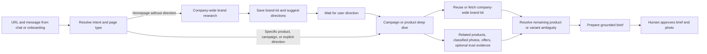

# Research agent revamp — proposed implementation plan

Keep Firecrawl as the retrieval layer. Separate company-wide brand research from research for a selected campaign or product. A homepage URL without campaign direction produces a reusable brand kit, then pauses for user input. A specific product/campaign URL, or an explicit direction supplied in chat, starts the relevant deep dive and gathers product URLs, classified assets, offers, and optional customer evidence that the concierge can use by ID.

Both chat and onboarding use this same routing and workflow. Suggestions help the user choose a direction; presenting a suggestion does not authorize the agent to research it automatically.

This is a planning document. No runtime changes or live provider tests have been made for this proposal.

## Current gaps confirmed in the repository

- `lib/workflow/firecrawl.ts` requests branding but saves only colors. It combines the Open Graph image and scraped image URLs into one list, capped at 60 before classification.
- `lib/workflow/agents/researcher.ts` reads only up to three explicitly supplied URLs. Its LLM receives page text, with no image classification step. It flattens color values and loses their semantic roles.
- `Source` extends `Product`, so a homepage, collection, and actual product page share the same type. There are no product or variant identities.
- `researchSummary` gives the concierge the first 12 images per page. `proposeBrief` checks that a photo appeared on that page, not that it depicts the selected product.
- The saved Loopy homepage fixture has 60 mixed image candidates, including URLs named for a logo, shipping graphic, banners, and product photography. These filenames illustrate the mixed pool; they are not sufficient classification evidence themselves.
- `Workflow.research` replaces the existing research. The UI's “Keep the existing brand context” instruction has no corresponding merge behavior.
- The renderer already accepts verified logo bytes, but research does not supply them. Rendering currently uses a fixed Geist font and resolves background/accent from color-array order.
- Sessions and image outputs currently use local files, not Supabase. Durable deployment remains a separate integration dependency.

## Target research contract

Separate source observations from the records used to plan an ad. Use `schemaVersion: 2`, stable record IDs, a revision number, and immutable snapshots for generated variants.

| Record | Main fields | Interpretation |
| --- | --- | --- |
| Brand kit | Name, canonical store URL, logo candidates and selected logo, colors by role, heading/body typography, voice, value proposition | Visual observations retain their source; voice and synthesized positioning are labeled inferred. |
| Campaign research | Brand-kit revision, user direction and its originating message/URL, campaign URL, selected product/collection scope, related product/asset/offer/evidence IDs, research status | Contains campaign-specific findings and visual overrides without replacing company-wide branding. |
| Product | Canonical URL, store product identifier when available, title, description, evidenced benefits, options/variants, price/currency/availability when found | A product page represents an entity, not an arbitrary collection of images. |
| Asset | Original URL, saved asset ID/path, MIME type, dimensions, roles, product/variant associations, evidence, classification status | Shared brand imagery and product photos can coexist without becoming interchangeable. |
| Offer | Type, display copy, exact evidence, code, scope, restrictions, dates, checked time, eligibility status | A source quote proves an observation, not current eligibility. |
| Audience | Suggested segments, needs/use cases, supporting observations, inference label | Optional; user edits override future inference. |
| Customer evidence | Testimonials, public customer-count claims, customer stories/endorsements, ratings | Optional; retain attribution, entity scope, source, and observation time. |
| Source snapshot | Requested/final URL, page type, fetched time, locale, raw response location, extracted evidence | Allows inspection and reprocessing without another scrape. |
| Research run | Scope (`brand` or `campaign`), stages, attempted pages, coverage, errors, duration, provider usage where available | Distinguishes completed brand research, a wait for direction, and partial campaign research. |

Each finding carries an evidence reference, extraction method, and origin (`observed`, `inferred`, or `user_supplied`). Confidence describes uncertainty; it does not establish truth. Human confirmation is a separate state and does not turn an inference into a sourced fact.

Optional fields use a nullable value plus `found`, `not_found`, `not_checked`, or `failed`. Do not force “unknown” prose into mandatory fields. Empty ratings or customer evidence must never block an evergreen product ad.

## Research flow, user checkpoints, and limits

1. **Resolve intent and page type together.** Preserve the supplied URL, selected variant, and accompanying message. Use URL structure as a hint, then page metadata/content when necessary. Locale paths, tracking parameters, About pages, and redirects cannot reliably identify campaign intent by themselves. Treat canonical links as evidence to validate. A homepage plus “promote this summer collection” already supplies direction. A product URL alone is enough to begin that product's research.
2. **For a homepage without direction, research the company.** Scrape branding, value proposition, voice, and optional company audience/customer evidence. Follow a small number of relevant About/brand-review links if useful. Classify brand assets and retain existing navigation labels or featured links as lightweight suggestion candidates. Do not follow product/collection links, hydrate galleries, or import a catalog yet. Temporary homepage promotions remain scoped observations; they do not become permanent company branding or a selected campaign.
3. **Pause after company research.** Save the brand kit and set the workflow to `awaiting_direction`. Show the findings with two or three grounded suggestions when available, plus free-text steering or a product/campaign URL. Suggestions can use observed categories or benefit-led creative ideas labeled as suggestions. Do not claim a bestseller, active discount, or product detail without evidence. The workflow must prevent campaign research or brief preparation until user direction exists; asking a question in prose alone is insufficient.
4. **For a supplied product/campaign or a user's follow-up, start a scoped deep dive.** A product URL triggers its details, variants, gallery, relevant offers, and optional product reviews. A campaign/collection page triggers its theme, terms, and linked product discovery; inspect a bounded shortlist and ask which product(s) to feature if ambiguous. Do not silently select an arbitrary item from a collection. A natural-language direction can use stored links or Firecrawl discovery to find matching URLs. Reuse the existing company brand kit, or obtain it from the homepage alongside the deep dive when absent; the user need not repeat a brand-only step.
5. **Extract, classify, and validate.** Parse product/organization JSON-LD and page structure first. Use schema-validated LLM output for semantic grouping, voice, audience, and offer/testimonial extraction. Use a vision-capable model for shortlisted ambiguous photos, with their IDs and surrounding page context. Never ask the model to invent asset URLs or identifiers. Persist successful sources before synthesis; optional extraction failures return partial results and targeted retry actions.
6. **Prepare the brief once its subject is clear.** Give the concierge the reusable brand kit and selected campaign research. Ask only for unresolved product/variant or creative choices. Keep the existing explicit brief/photo approval before generation; a specific URL authorizes research, not image generation.

Scrape formats remain purpose-specific. Homepage: branding, markdown, links, images, and raw HTML. Product pages: markdown, raw HTML, images, and links. Supporting pages: markdown, with HTML where structured evidence needs it. Keep announcement bars on brand/offer reads. Firecrawl supports these formats; page scope and product association are application logic. [Firecrawl scrape contract](https://docs.firecrawl.dev/agent-source-of-truth/curl).

Use homepage/page links first and Firecrawl Map when discovery is needed within the chosen research scope. Map discovers candidates; scrape verifies content. Candidate URLs are not researched products. [Firecrawl Map documentation](https://docs.firecrawl.dev/features/map).

Proposed limits per stage: company research gets the homepage plus up to two relevant company-information pages and zero product-page scrapes. A subsequent campaign deep dive gets up to eight scraped pages including at most three product detail pages initially; supplied URLs take priority. Discovery, when needed, returns at most 100 candidates per request. Allow at most three concurrent scrapes and a deadline below the existing five-minute chat deadline; stop optional work and save partial findings when the budget is exhausted. Tune timing after measuring real requests. These are separate user-directed stages, not a single automatic eight-page onboarding run.

Persist workflow status and direction independently of conversational memory: `brand_researching` → `awaiting_direction` → `campaign_researching` → `needs_selection` (only when ambiguous) → `ready_for_brief`. Specific product/campaign inputs enter `campaign_researching` directly, collecting missing brand context as part of that stage. Resuming a session in `awaiting_direction` must not start scraping products. New explicit user direction is the transition trigger; a stored suggestion is not.

Use cached brand observations when acceptable; request fresh evidence for an offer before it is used. Record locale/currency and fetch time. Browser actions are a bounded fallback for a missing gallery or review widget. Broader external research is an explicit “Find more customer evidence” action using Firecrawl Search, followed by scraping the original source; search snippets alone are not ad evidence.

## Deterministic control and hallucination boundaries

The target is predictable execution with evidence-grounded findings. Correct execution can be enforced by code; interpreting arbitrary web content remains fallible. A repeated answer, valid JSON, or a model's confidence score is not proof that an answer is true. Firecrawl's enriched branding/extraction output is also candidate data, not an independent verification authority.

### Code owns transitions and execution

Use a small persisted state machine in the existing workflow service, with focused extraction functions inside each stage. Once an action is selected and validated, code schedules its scraping, extraction, validation, saving, and stopping behavior. The model does not decide whether to skip the direction checkpoint, declare extraction complete, or exceed the page budget.

| Event or stage | Code-controlled behavior | Limited model role |
| --- | --- | --- |
| URL submitted | Normalize the actual input; inspect the submitted page and strong page-type signals; choose a known route or mark ambiguity | Propose a page label from supplied evidence when rules are insufficient; allow `unknown` |
| Company research | Execute the brand-only recipe; save results; transition to `awaiting_direction`; end research | Synthesize voice/audience and suggest directions from observed material |
| Waiting for direction | Accept an actual new user event; expose no campaign-research/brief action until it resolves direction | Interpret free text against known choices, or ask one targeted clarification |
| Campaign research | Enforce chosen scope, URL candidates, fetch limits, product associations, and completion criteria | Rank discovered candidates and classify uncertain assets; return IDs plus supporting evidence |
| Ready for brief | Resolve selected IDs; check assets, scoped claims, brand revision, and required fields | Draft copy/direction from the validated context |
| Generation | Check explicit approval of the current brief, record the attempt, and enforce existing duplicate/retry rules | No authority to approve, bypass checks, or invent success |

Offer only stage-appropriate tools to the concierge, and enforce the same rules in every server handler. Hiding a tool reduces mistakes but is not the guard itself. Derive UI progress and completion messages from saved events, not model prose. Preserve the existing generation approval and attempt protections.

Clickable product/direction suggestions submit stable choice IDs; pasted URLs are parsed from the actual user message. Both paths produce explicit events the server can resolve. For free text, a narrow intent extraction returns an allowed intent, candidate IDs, and an excerpt from the actual new user message, with an `unclear` option. Validate the excerpt and IDs, but acknowledge that this cannot prove semantic intent: negation, hypothetical questions, and vague replies can still be misread. Ask for clarification when ambiguity changes the research scope. Do not demand a second confirmation for an already explicit product URL or selection.

### Code parses facts; models propose interpretations

- Prefer deterministic parsing of product identifiers, gallery membership, numeric prices, rating values/counts, and font/color declarations when the retrieved source exposes them. Validate types, ranges, units, entity identity, and conflicting observations. Structured source data can itself be stale or wrong; source presence does not certify current truth.
- Give the LLM bounded source excerpts and a registry of real candidate IDs. Require IDs and evidence references back. Resolve values and URLs from server records. A nonexistent ID is rejected; an existing but wrong product/image pairing also fails the association check.
- Keep an extraction result as a candidate until applicable evidence/consistency checks pass. Never convert a model's self-reported confidence directly into generation eligibility. Uncertain product/variant associations require additional source evidence or a saved user correction.
- For claims, verify the cited span exists and that values, subject, and qualifiers match. Exact quote matching alone does not prove that a paraphrase is supported. Preserve complete offer restrictions and rated-entity scope. Use exact supported claim blocks for prices, offers, ratings, and customer counts; general creative copy still needs semantic review and user approval.
- Store logos and photo bytes as selected assets. Resolve semantic colors and supported font choices in code. The model does not regenerate a logo or invent a font file.
- Voice, audience, and creative suggestions remain explicitly inferred. Allow missing values and abstention. Failure to find a rating is a valid result, not a reason to generate one.
- Keep scraped content out of privileged instructions. Page text cannot change the selected workflow stage, tool permissions, budget, or approval state.

A concrete rejection case: a source states “20% off selected styles for first orders.” The model proposes “20% off everything.” A matching quote and valid schema are insufficient; the application must preserve the restrictions, verify product eligibility, and omit the offer if eligibility is unresolved. Similarly, a 4.8 rating for product A cannot be attached to product B simply because both are in the same store.

### Stable reruns and measurable reliability

Save raw source snapshots, normalized inputs, extraction/model/prompt/parser versions, validated records, and user overrides. Reuse saved results for an unchanged research revision. Explicit refresh creates new observations; it does not silently replace approved snapshots. Stable candidate ordering, fixed page limits, caching, and lower-variance sampling where supported improve repeatability, but none establish factual correctness. Do not rely on temperature settings as a correctness control.

Test flow and factual quality separately. Stub the LLM to request a deep dive without direction, submit nonexistent IDs, select another product's photo, invent approval, and report completion after failure. These must not execute forbidden actions or produce false saved status. Separately evaluate extraction against annotated snapshots: wrong associations, unsupported claims, dropped restrictions, optional-field abstention, and missed valid findings. Add chat-intent examples covering explicit choices, negation, vague replies, and hypothetical requests. Human correction rate and useful coverage matter alongside false-positive rates.

Start with a small set of supported ecommerce page structures and a conservative unresolved path for others. Add parsers using observed failures. This makes the product predictable without claiming universal automatic understanding of every storefront.

## Product grouping and image classification

Model **role** and **ownership** separately. An image can be product lifestyle photography and also brand inspiration; that does not make it a valid reference for every product.

Asset roles: `logo`, `product_photo`, `product_lifestyle`, `brand_lifestyle`, `promotion_graphic`, `icon`, `swatch`, and `unknown`. Track `containsMultipleProducts`, `containsPromotionalText`, and `eligibleAsProductReference` separately. Excluded assets remain inspectable and correctable.

Association precedence:

1. Explicit product/variant identifiers and image associations from product structured data or embedded store data in the Firecrawl response.
2. Main product gallery membership and nearby product links/captions. Exclude recommendation carousels from the main product's gallery.
3. Image alt text, surrounding copy, and visual comparison as supporting evidence. A filename or visual resemblance alone cannot establish an exact SKU/variant.

Group by the store's product identity and canonical page. Preserve variant attributes such as color, pattern, size, and compatible device when actually provided. Keep a broader family/category separate from a purchasable variant. A generic phone-case photo cannot establish which device version it depicts.

Normalize relative URLs and deduplicate exact assets and known CDN size variants. Preserve version/variant parameters and original fetch URLs; do not strip all query strings. Retain all product associations for genuinely shared images. Prefer adequate-resolution gallery images and inspect uncertain candidates before eligibility. Apply download/vision budgets after prioritization, rather than taking the first 60 URLs.

Unknown or contradictory ownership stays unresolved. The UI lets the user assign, move, or exclude an asset, with that correction persisted. A logo, shipping icon, collage, or unrelated recommended product must fail server-side product-reference validation even if it appeared on the same page.

## Brand extraction and downstream use

Firecrawl's branding output exposes logo/image information, semantic colors, and typography. Preserve these fields rather than reducing the response to hex values. Treat extracted values as observations requiring normalization and occasional review. [Firecrawl branding documentation](https://docs.firecrawl.dev/developer-guides/cookbooks/brand-style-guide-generator-cookbook).

- **Logos:** collect branding candidates, organization metadata, and header/footer marks. Distinguish store logos from payment/review-provider marks and favicons. Save actual bytes and dimensions; support light/dark variants when observed. Use a safe renderable copy for SVGs. Do not redraw the wordmark or silently substitute a favicon. If no usable logo exists, allow an upload or an ad without one.
- **Colors:** preserve primary, secondary, accent, background, and text roles with evidence. Prefer homepage/header observations for the brand kit. Product and temporary campaign colors are contextual palettes, not replacements for the brand palette. Resolve render tokens by role and legibility.
- **Typography:** capture observed heading/body families, weights, and fallbacks. Track the render font separately. Finding a family name does not make its font file available. Use a supported, available font asset or show the explicit bundled-font substitution; copy fitting and rendering must use the same bytes.
- **Voice:** save a short inferred description, tone traits, useful wording, and source examples. Keep audience and voice independent so changing the target audience does not silently rewrite the brand identity.

Wire the selected logo into the existing renderer and snapshot resolved logo/font/color choices on the approved brief. An extracted brand kit that never reaches composition would leave the current product problem unresolved.

## Offers and optional customer evidence

**Offers:** capture percentage/fixed discounts, sale pricing, bundles, and shipping incentives when observed. Save exact quoted terms, code, minimum spend, eligible products/variants/collections, first-order/subscriber restrictions, geography, currency, start/end dates when given, and `lastCheckedAt`. Unknown scope stays unknown. A schema.org `Offer` can be a normal price, so its presence alone is not a promotion. “Up to” and “selected styles” must survive into the brief and rendered copy.

Retain the current exact-evidence check and extend it to stored HTML/structured-data evidence. Check that the extracted value and qualifiers are supported, not merely that some quotation exists. Before selecting an offer, validate product scope and freshness. Expired, conflicting, or unconfirmed eligibility is excluded from the default brief. A stale offer recheck that changes terms creates a new brief revision and requires approval.

**Ratings:** capture value, scale, rating count and/or review count without conflating them, rated entity, provider, source URL, and timestamp. Distinguish a product rating from store-wide ratings. Do not aggregate unrelated products or review providers. If evidence conflicts, surface the conflict rather than choosing the more flattering number.

**Customers:** interpret this as public social proof: attributed testimonials, published customer-count claims, customer stories, and clearly evidenced endorsements. A “trusted by” logo is not the store's logo and does not automatically establish permission or a particular customer relationship. Preserve exactly what the source claims. Do not infer actual customer counts or testimonials from the proposed audience.

**Audience:** infer needs and plausible use cases from product benefits, store language, and available reviews. Label the result inferred and make it editable. No demographic certainty is required to prepare a useful brief.

All these optional findings need evidence/availability states. Missing customer evidence means the concierge suggests a benefit-led ad. The first release can surface trust evidence in research and concierge context; a dedicated rating/testimonial graphic requires an explicit renderer component and claim reference, not an instruction for fal to draw one.

## Concierge, UI, and persistence

Replace the page/image dump with stage-specific context. After company research, provide the brand-kit revision, optional company evidence, suggested directions, and `awaiting_direction` status. After the user supplies a campaign/product direction, add scoped product summaries, eligible asset IDs and thumbnail descriptions, applicable offers, optional customer evidence, and unresolved questions. Retrieve deeper evidence only within that chosen scope. Keep the existing concierge ToolLoopAgent and schema-validated extraction helper; a separate autonomous agent per field is unnecessary.

Give brand research and campaign research distinct operations, such as `researchBrand` and `researchCampaign`, behind one shared intake/router for chat and onboarding. The workflow service enforces stage transitions and records the user message or supplied specific URL establishing direction. Do not let a tool argument invented by the concierge count as user direction. Existing brand context is reusable across campaigns; campaign colors, offers, targeting, and product choices are stored separately.

Change brief inputs to `productId`, optional `variantId`, `referenceAssetId`, optional `logoAssetId`, `offerId`, and selected `trustEvidenceIds`. Server code resolves URLs and validates ownership, roles, revisions, and claim scope. Extend the reviewer to check these associations. Copy-only claims also need validation against selected evidence so they cannot bypass structured offer/trust selection.

The research screen should show:

- Brand kit: logo choices, semantic palette, observed/render typography, editable voice.
- Direction checkpoint: after brand-only research, grounded suggestions plus a free-text/URL input; product research remains pending.
- Products: once campaign research begins, one card per product with its gallery and variant associations; an “Unsorted” area for ambiguous images.
- Offers: full terms, scope, checked time, and explicit no-offer option.
- Audience/customer evidence: optional sections with source links and inference badges.
- Coverage: distinguish “Brand research complete — choose a direction” from incomplete/failed campaign research. Show pages checked and products researched within the chosen scope; “Find more products” does not imply a complete catalog.

Allow “This is a banner,” “This belongs to another product,” and brand/audience corrections. Persist user overrides separately from extracted values so refreshes preserve them. Adding a product merges by canonical identity within the same brand. A different store creates a separate brand context. Failed enrichment never erases existing findings.

Keep immutable research/brief snapshots on old variants. Changes affecting an active brief revoke its approval; adding unrelated findings should not alter the approved snapshot or make saved images disappear. Legacy sessions remain viewable, but unclassified legacy images must be classified or explicitly confirmed before reuse in a new brief.

For the fixed deployment stack, persist brand kits, campaign research/direction/status, products, asset associations, sources/runs, offers, and evidence in Supabase Postgres; save approved source-photo/logo bytes and final outputs in Storage. Preserve original URLs and hashes for provenance. Fetch source assets through validated server code with type/size limits; keep SVG conversion isolated. Do not expand the fal-only download function to accept arbitrary source URLs. Local persistence can support the first vertical slice, but Supabase migration must be complete before calling this deployable.

## Implementation sequence

| Increment | Changes | Completion check |
| --- | --- | --- |
| 1. Brand stage and routing | Versioned brand/campaign records, intent/page routing, richer Firecrawl branding, optional states, legacy adapter, persisted direction checkpoint | Homepage-only input saves company findings and stops before any product-page scrape; chat and onboarding behave alike. |
| 2. Scoped deep dive and asset accuracy | Product/campaign input handling, product parsing, gallery associations, roles, dedupe, shortlist classification, server eligibility checks, merge behavior | Specific links begin relevant research; product selection cannot use a logo or another product's image; the brand kit survives. |
| 3. Concierge and user steering | Stage-specific context, direction suggestions, ID-based briefs, grouped UI, persistent corrections, logo/color rendering integration and explicit font fallback | User direction starts the deep dive; corrections change the next brief and composed ad after approval. |
| 4. Offers and optional evidence | Scoped offers, rating/testimonial extraction, audience inference, evidence checks, fresh offer validation | Unsupported/stale/cross-product claims are rejected; missing optional data still permits generation. |
| 5. Discovery and deployment | Discovery bounded to the chosen scope, progress/partial results, targeted enrichment, Supabase persistence, production verification | Homepage → brand kit → user direction → scoped products → approved creative works across reloads on the deployment. |

Build the homepage checkpoint and supplied-product path first, then add campaign/collection discovery once classification is trustworthy. Automatic discovery stays within the user-selected research scope.

## Acceptance and evaluation

Use saved Firecrawl responses for repeatable tests and separate live runs for provider integration. Include Loopy Cases and four contrasting stores: a single-product store, an apparel store with many variants, a large mixed catalog, and a store with sparse branding/review data. Select actual sites during implementation; no live results are claimed here.

- Annotate representative logos, banners, product galleries, recommendation carousels, swatches, duplicates, and ambiguous images. Measure eligibility precision and product/variant association accuracy, plus coverage and user-correction rate. Start with zero known cross-product or logo-as-product errors in the curated acceptance set; this is not a claim of universal accuracy.
- Verify homepage and direct-product onboarding, incomplete JSON-LD, relative/CDN URLs, dark/light logos, absent fonts, and a review widget that fails to load.
- Assert that homepage-only input in either chat or onboarding makes zero product-page scrape calls and persists `awaiting_direction`, including after reload. Suggestions cannot advance that state.
- Verify a homepage with explicit product direction proceeds to the scoped deep dive; a direct product/campaign URL works without a redundant direction question and obtains missing brand context. Locale paths, About pages, and tracking parameters do not falsely imply product/campaign intent.
- Verify a campaign/collection containing several products presents grounded choices without inventing a single selected product. A user reply supplying a direction or choosing a suggestion triggers only relevant discovery and product scrapes. Campaign styling and promotions never overwrite company-wide brand fields.
- Exercise scoped/expired/first-order offers, product versus store ratings, unsupported customer counts, missing optional fields, and contradictory sources.
- Verify adding a product and refreshing research preserve user corrections and old variants; affected brief revisions lose approval and unrelated enrichment preserves the approved snapshot.
- Verify the concierge can select only eligible IDs; the reviewer and renderer use the saved product, logo, colors, font choice, and exact approved claims.
- Measure scrape count, completion time, partial-result frequency, and cost per usable product. Run existing tests, typecheck, lint, and build after implementation, then inspect a real Loopy creative and a feedback-driven revision.

Defer full-catalog synchronization, continuous offer monitoring, broad third-party reputation analysis, arbitrary font ingestion, and new trust-badge layouts until the core classification and grounding path works.
