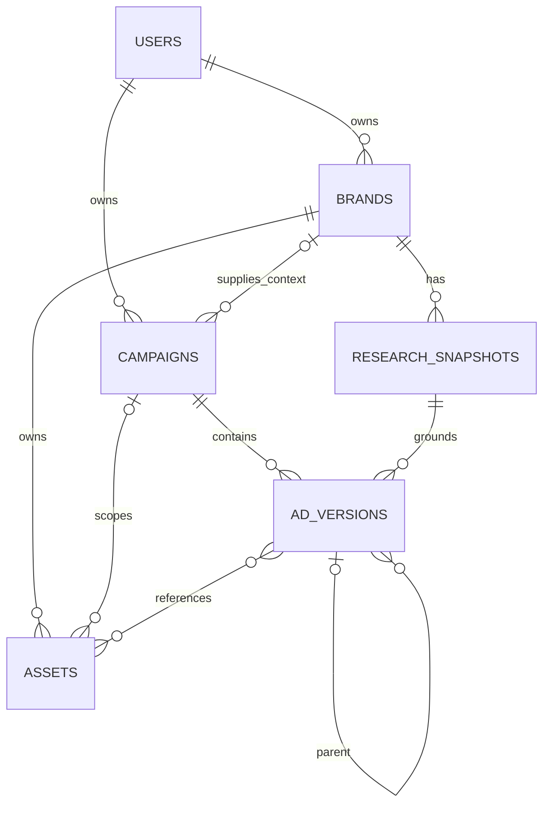

# Supabase persistence — design and implementation handoff

Status: agreed design direction; implementation has not started.

## Objective and scope

Move the existing research → approved brief → generation → review workflow from local JSON/PNG files to Supabase Postgres, Auth, and Storage. Preserve the current UI and workflow behavior while making saved work durable and isolated between visitors. Different users researching the same company must never share private research edits, conversations, approvals, or creatives.

This plan follows [AGENTS.md](../AGENTS.md) and the independent review of the initial proposal. Use five application tables. Keep evolving research data in versioned JSONB. Spend implementation effort on ownership, approval integrity, paid-request protection, and durable assets rather than introducing a general job system.

This is an engineering handoff, not the assignment's user-written product note or user-drawn architecture deliverable. No infrastructure has been provisioned and no runtime changes are included.

## Current implementation and migration boundaries

| Existing code | Current behavior | Migration responsibility |
| --- | --- | --- |
| `lib/workflow/sessions.ts` | Whole-session JSON files; process-local lock | Repository backed by Postgres; distributed campaign claim |
| `lib/workflow/session-types.ts` | Session, research, draft brief, completed variants | Preserve response shape through a hydration adapter |
| `lib/workflow/service.ts` | Workflow rules, approval checks, attempt marker, checkpoints | Preserve rules; move critical transitions into atomic database operations |
| `lib/workflow/storage.ts` | Local provider visual and final PNG files | Private Storage objects plus asset records |
| `lib/workflow/agents/artist.ts` | Generates a visual, saves it, composes exact copy | Preserve checkpoint order and visual reuse |
| `lib/workflow/creative/reuse.ts` | Compares reference URL and visual inputs | Compare stable asset identity, never expiring signed URLs |
| `lib/workspace/api.ts` | Session API contract; groups variants using parent ancestry | Keep API shape and existing grouping behavior |
| `app/api/chat/route.ts` | Saves conversation after streaming | Honor campaign claim through final persistence |
| `app/api/outputs/[id]/route.ts` | Reads local final image | Authorize owner, resolve final asset, serve durable bytes |

The current workflow stores generated images locally already. Scraped product photos remain remote URLs. Brief IDs already become final generation IDs, which makes a single row for draft and generated version a natural fit.

Read the relevant installed Next.js guides in `node_modules/next/dist/docs/` before writing framework code. Follow applicable AI SDK and Firecrawl skills if modifying their integrations.

## Model overview



`USERS` means Supabase's existing `auth.users`, not another application table. The version-to-asset relationship is implemented by explicit asset-reference columns, not a join table. A saved visual can be referenced by multiple versions.

Every application row has a UUID primary key, `user_id`, and `created_at`. Mutable records also have `updated_at`. Relationships use IDs, not URLs. Use `user_id` consistently for ownership throughout the schema.

### 1. `brands`

- `id`, `user_id`, `normalized_hostname`, `name`.
- `brand_kit_schema_version`, `brand_kit` JSONB: current name/logo selection, colors, voice, audience, value proposition, and user corrections as supported by the app.
- `created_at`, `updated_at`.
- Unique `(user_id, normalized_hostname)`.

Normalize hostname casing and an ordinary leading `www.`. Preserve other subdomains; do not reduce every host to a registrable domain. Keep original submitted URLs in research input data, including product paths and meaningful query parameters. This key represents a user's saved store, not universal company identity. Cross-host aliases require explicit handling later.

Each user gets a separate Loopy Cases brand record. One user may reuse their brand across campaigns. Refreshing research must not silently overwrite user corrections in the current brand kit; retain field origin in its JSON where necessary. Generation captures the resolved brand values on its version.

### 2. `research_snapshots`

- `id`, `user_id`, `brand_id`.
- `schema_version` integer, `data` JSONB, `created_at`.
- Immutable after insertion; each saved research result is a new row.

Start with one JSONB payload, shaped around the current research contract:

```json
{
  "inputs": {
    "storeUrl": "https://www.loopycases.com",
    "productUrl": null,
    "campaignUrl": null
  },
  "sources": [],
  "findings": {
    "colors": [],
    "voice": "",
    "audience": "",
    "sales": []
  },
  "warnings": []
}
```

This illustrates the envelope, not valid completed research. Define a Zod schema with the actual source/finding constraints. Each source preserves requested URL, fetch time, title, description, bounded markdown, image candidates, and extracted colors. Keep evidence URLs and quotes for offers, stable offer IDs, and the distinction between observed facts and inferred voice/audience. Preserve a final resolved URL when retrieval supplies one.

Validate on write and parse by `schema_version` on read. The column is the authoritative version marker; do not maintain a second conflicting version number inside the payload. Unknown versions fail with an actionable compatibility error. Known legacy versions get explicit adapters. JSONB avoids frequent database migrations, not application contract maintenance.

Initially preserve existing source-count and content limits. Do not append future research into an ever-growing row. Do not select `data` for campaign listing. If broader research later produces large documents, move raw source content to Storage or a source table while keeping concise findings and evidence references here.

Failed research attempts go into campaign events/last error; they do not require placeholder snapshots. A partial result may be saved with warnings. Later stages that add evidence create a successor snapshot. Old versions retain their original snapshot ID.

### 3. `campaigns`

- `id`, `user_id`, nullable `brand_id` before onboarding.
- `name`, `status` (`active` or `archived`).
- Nullable `current_research_id`, `current_version_id`.
- `preferences` JSONB, `messages` JSONB array, `events` JSONB array, nullable `last_error`.
- `revision` integer, nullable `lease_token` UUID and `lease_expires_at` timestamp.
- `created_at`, `updated_at`.

One campaign maps to one existing session. Keep messages in their existing normalized UIMessage format. Short demo conversations do not justify a separate messages table yet. Workflow progress remains derivable from the current draft/execution state and events; do not duplicate it into a second competing status machine.

Once research is attached, treat the campaign's brand as fixed. A different company starts another campaign, preserving the old one. Additional product/campaign pages from the same store produce new research snapshots in that campaign. Do not infer company identity from image CDN hosts.

Preferences or research changes invalidate the pending brief's eligibility for generation. Generated versions retain historical approval and evidence. Keep current-pointer updates and draft invalidation in the same database transaction.

### 4. `ad_versions`

- `id`, `user_id`, `campaign_id`, `research_snapshot_id`, nullable `parent_version_id`.
- `product_url`, `reference_source_url`, required `reference_asset_id` before approval.
- `headline`, `cta`, nullable `offer_text` and `sale_id`, `direction`, `feedback`.
- `design_schema_version`, `design` JSONB, `brand_tokens` JSONB, `renderer_version` when composed.
- Nullable `brief_approved_at`, `approved_at` for the finished ad; approval is performed by the campaign owner in this scope.
- `generation_state`, nullable `attempted_at`, `generation_error`.
- Nullable `model`, `prompt`, `seed`, `provider_request_id` when available, `provider_output_url` for recovery.
- Nullable `visual_asset_id`, `final_asset_id`.
- Nullable `review_status`, `review` JSONB, `review_error`.
- `created_at`, `updated_at`, nullable `generated_at`.

A proposed brief is a row before generation. Editing creative content creates another row. `parent_version_id` represents the generated variant being iterated on, matching current behavior; it is not a generic pointer to every superseded draft. New drafts may be retained without appearing in the finished-ad gallery.

Creative content is fixed for that row; execution, review, and approval metadata can change through controlled transitions. Record the exact rendered copy (including complete offer conditions), resolved tokens, design, and renderer version. Do not reconstruct historical copy from the latest brand kit or research. Validate that `sale_id` exists in this version's snapshot; JSON-contained offer IDs cannot be protected by an ordinary foreign key.

Keep generation state separate from review state:

| Generation state | Meaning / next allowed action |
| --- | --- |
| `not_started` | May claim generation after current-brief approval and validation |
| `submitted` | Attempt recorded before provider call; do not submit again |
| `outcome_unknown` | Submission may have been billed; inspect/recover, never automatically resubmit |
| `failed` | Known failure recorded; a new paid attempt needs a new approved version |
| `output_pending_storage` | Provider result URL saved; retry copying the same output |
| `visual_ready` | Durable compatible visual exists; compose without a provider call |
| `complete` | Durable final image exists; review independently |

An active `submitted` request is not a failure. After interruption/lease expiry with no persisted result, treat it as unknown. A composition error leaves `visual_ready` plus its error; a review error leaves generation `complete`. Compatible visual reuse moves a fresh approved version directly to `visual_ready` without a paid submission.

Review statuses retain `pending_review`, `review_failed`, `needs_changes`, `needs_human`, and `reviewed`. The Session adapter maps a non-null finished-ad `approved_at` to the existing UI's `approved` status. Only a passing review allows human approval. Re-running review revokes prior finished-ad approval until a new pass and human confirmation. Multiple versions may be approved.

There is no `ads` grouping table and no `generation_runs` table. The existing ancestry-based gallery grouping remains sufficient, and the current workflow permits one paid visual submission per version. A database claim does not make an external provider call exactly-once.

### 5. `assets`

- `id`, `user_id`, `brand_id`, nullable `campaign_id` for shared brand assets.
- `kind`: initially `product_photo`, `logo`, `generated_visual`, `composed_ad`.
- Nullable `source_url` for provenance and `source_research_id` when applicable.
- `bucket`, `storage_path`, `storage_state` (`pending`, `ready`, `failed`), nullable `storage_error`.
- Nullable MIME type, width, height, byte size, content hash until verified.
- `metadata` JSONB: visual inputs and generation provenance needed for reuse/recovery.
- `created_at`, `updated_at`; unique `(bucket, storage_path)`.

The application owns this metadata table; it does not replace Supabase's internal Storage metadata. Asset bytes are immutable once ready. Intermediate visuals and final ads use the same table and bucket. Do not delete a shared visual when one referencing version is archived.

## Ownership, constraints, and access

Use Supabase anonymous sign-in for a no-signup demo with a distinct identity per visitor. Clearing the session/browser data loses access unless the account is linked later; do not promise cross-device recovery. No additional profiles or organizations table is needed.

- RLS limits reads to `user_id = auth.uid()` for all five tables. Private Storage policies enforce the equivalent ownership boundary.
- All workflow mutations run through authenticated server routes. Verify the caller through Supabase Auth; never trust a user ID supplied in a request body or by the agent.
- Keep protected mutation RPCs server-only: revoke execution from public/anonymous/authenticated browser roles and call with the server credential. The server derives owner ID from verified identity. Service credentials bypass RLS, so every privileged query/RPC must still check that owner explicitly. Never expose the credential to the browser.
- Browser users must not be able to directly update approval, generation state, leases, or asset readiness. RLS row ownership alone does not prevent forging these fields.
- Use foreign keys plus composite ownership constraints, and transactional checks for relationships that span tables: research must belong to the campaign's brand/owner; current version and parent must belong to the campaign; assets must belong to that owner/brand and either the same campaign or be brand-scoped. Check asset kind/readiness before assigning it to a version role.
- Parent assignment is insert-only and must target an existing generated version, preventing later ancestry cycles. Do not allow arbitrary reparenting.
- Index ownership/lookup paths: brands' unique owner/hostname, campaigns `(user_id, updated_at)`, snapshots `(brand_id, created_at)`, versions `(campaign_id, created_at)` and parent ID, and asset foreign keys. Start without broad JSONB indexes; add them for actual query needs.
- Archive campaigns rather than implementing destructive delete cascades and Storage cleanup in this migration.

## Concurrency and transaction boundary

The existing process-local Set cannot protect multiple Vercel instances. Every campaign mutation, including chat, uses the same database-backed lease protocol.

1. Atomically claim an unclaimed/expired campaign for its verified owner; otherwise return the existing busy response. A practical starting lease is six minutes for the existing five-minute request deadline. Verify all mutation routes remain within that bound; longer work requires renewal or smaller stages.
2. Return a fresh lease token and the campaign revision. Each persistence transaction checks the token, unexpired lease, owner, and expected revision, then increments the revision. Old workers cannot overwrite a newer holder's work, even after expiry.
3. Keep transactions short. Never hold a database transaction open while scraping, generating, streaming, downloading, or rendering.
4. Before fal, atomically verify the current version/research, approval, ready source asset, and unattempted state; persist `submitted` and `attempted_at`. Losing the claim stops further side effects. A second request cannot claim this version for another paid submission.
5. Hold the lease through final stream persistence and release only using the matching token. Exceptions release in cleanup; crashed processes recover through expiry. A lost lease cannot be used to commit late results. Such a provider result may require operator recovery; do not hide this limitation with an automatic new generation.

Use a small repository with transactional RPCs for workflow transitions/checkpoints. Do not replace `saveSession()` with independent upserts across five tables. Retain the in-memory workflow object as convenient, but final chat persistence must not blindly rewrite stale approvals or completed versions. Database state is authoritative.

## File lifecycle and recovery

Use one private bucket, for example `creative-assets`, with immutable paths such as `{user_id}/{brand_id}/{asset_id}/image.png` (use the actual verified extension). Persist bucket/path, never a signed URL as the durable location. Issue short-lived signed URLs only for authorized UI/provider access; give provider URLs enough lifetime for the bounded request. Keep final `/api/outputs/:id` URLs stable through the authorized route.

1. Candidate scraped images may remain remote URLs in the snapshot. Do not copy the entire storefront gallery.
2. Before presenting a brief for approval, copy the selected photo into Storage, validate it, and pin its asset ID. Display that saved photo for approval. Do the same for a selected logo. Generation/review must use the pinned bytes, not refetch a mutable store URL.
3. Remote fetching is server-controlled and limited to validated research candidates. Validate HTTP(S), redirects and destinations, disallow private/local network targets, apply byte/time limits, and verify image type/dimensions. The existing URL syntax helper alone is not a complete download boundary.
4. After fal returns, save the recovery URL/provenance before downloading. Insert the pending visual asset with a deterministic destination path. Upload bytes, verify success, then transactionally mark the asset ready and attach the visual checkpoint.
5. Compose from the saved visual. Upload the final PNG, then transactionally attach the ready final asset and mark the version complete. Preserve the current 576 × 1024 PNG requirement during this migration.
6. Review only after the final asset is durable. Review failure retains the image and permits a review-only retry.

Storage uploads and Postgres writes are not one atomic transaction. If an upload succeeded but the database update failed, a retry checks the existing path and expected bytes/metadata and finishes registration; it does not overwrite ready content or call fal. If download/upload failed, retry the saved provider output while available. If it expired, report that recovery failed and require an explicit new approved version for another paid request. Stale `submitted` attempts without a recovery URL stay unknown.

## Compatibility with the other plans

[Research revamp](research-agent-revamp-plan.md): its richer products, asset candidates, offers, evidence, stages, and direction can evolve the versioned research payload without new entity tables. Stable IDs inside the payload are local to that snapshot and validated in the application. Promoted durable image assets get actual `assets` rows; keep candidate IDs distinct from durable asset IDs. Persist workflow direction/stage in campaign fields when that feature is implemented, rather than relying on chat history. Do not implement the whole research revamp as a persistence prerequisite.

[Artist flow](artist-flow-plan.md): its proposed product/mask/background layers can extend asset kinds and explicit version references. This plan targets the current single-visual artist. If the redesigned artist lands first, adapt the version execution state to its small fixed stages: each paid stage needs its own durable attempt marker and asset checkpoint. One version-wide attempt flag cannot safely represent both segmentation and background generation. This does not require building a generic job framework now.

## Implementation sequence

1. **Schema and identity:** add Supabase client/server setup, migrations for the five tables, constraints, indexes, private bucket, RLS and server-only mutation functions. Configure anonymous sign-in and local/Vercel environment variables; document setup without recording secrets. Test with two identities before connecting providers.
2. **Repository and concurrency:** implement owner-scoped campaign listing/loading, snapshot parsing, transactional transitions, and lease acquisition/release. Hydrate the existing Session response: current snapshot → `research`, current version → `brief`, complete versions → `variants`, and saved messages/events/preferences. Load historical snapshots in batches. List campaigns from summary columns only.
3. **Assets:** replace local image reads/writes, capture approved source photos, update visual reuse to stable IDs, authorize the output route, and preserve checkpoint/recovery behavior. Keep provider URLs out of normal client responses.
4. **Wire workflow and routes:** connect research, brief creation, preference updates, approval, generation, review, and streamed chat to the repository. Ensure both chat tools and direct UI actions share exactly the same guarded transitions. Do not introduce a silent local-filesystem fallback on database failures.
5. **Import local demo data:** provide an explicit one-time importer with a dry run and specified destination owner. Retain source files. Preserve existing IDs where consistent, deduplicate repeated snapshots/visuals within that owner, upload assets, and validate references before committing dependent rows. Re-running must not duplicate data or call providers. Split sessions that contain historical creatives from different brands into separate campaigns. Report missing bytes and conflicting records rather than fabricating assets. Preserve legacy completed ads as viewable even when they lack reusable visual components; old ungenerated drafts require fresh source capture and approval. Preserve attempt markers for ambiguous historical generations. Do not claim a newly fetched product photo is the exact original input of a historical generation.
6. **Verify and deploy:** run the targeted checks below, then existing tests, typecheck, lint, and build. Smoke-test on Vercel with separate visitors and a fresh server instance. Update README setup/recovery instructions. Report any checks blocked by missing credentials rather than treating them as passed.

The migration can be developed behind a repository interface, but maintain one production persistence source of truth. No dual-write period or synchronization system is required for this demo.

## Acceptance checks

Use existing workflow tests for existing business behavior; add integration tests where real database/Storage behavior matters.

- Two users enter the same Loopy URL: each gets private brand/campaign data. Guessing IDs cannot read images or messages, forge approval, or attach another user's assets/research. Direct client mutation of protected fields/RPCs fails.
- The same user reuses a brand across campaigns; company switching creates a new campaign. Historical research and ads remain attached to the correct brand.
- Restart/redeploy after research, draft approval, visual checkpoint, and final generation: each stage loads correctly without local files. Campaign listing does not download full research payloads.
- Editing copy/preferences or changing research makes stale draft approval unusable. Old generated versions retain exact copy, tokens, source identity, evidence, and renderer version.
- Two independent server processes submit the same version concurrently: only one reaches fal. Exercise lease expiry and a late writer; stale messages/state cannot overwrite newer data.
- Provider timeout after submission remains unknown and does not auto-retry. Inject failure after provider result persistence, upload, and checkpoint commit; recover at the correct stage without another paid request.
- Copy-only revision reuses the visual, produces a new final image, and is reviewed again. Multiple versions can be approved independently.
- Review failure keeps the finished image. Re-review does not regenerate, and a changed review requires fresh human approval.
- Expired signed URLs do not break persisted references; authorized URLs can be reissued. Unsafe or oversized source images fail before generation.
- Current and known legacy research schema versions load through their adapters; unsupported versions produce a useful error. Research refresh never rewrites an old snapshot.
- Import dry run reports missing/conflicting data, and two real import passes produce the same records without changing local source files.

## Explicitly deferred

Separate ad-group/message/attempt tables; product catalogs; organization/team membership; shared cross-user scrape caches; full event sourcing; background workers; automatic provider retries; scheduled cleanup and retention tooling; broad research analytics. Add these when product behavior or measured scale requires them.

Keep short conversations and bounded research documents for this demo. If conversations grow, a messages table can be introduced independently. If raw research grows, externalize source documents. If multiple retries per version become intentional, introduce an attempts table. None requires changing the core ownership or version relationships.

## Reference documentation

- [Supabase anonymous sign-ins](https://supabase.com/docs/guides/auth/auth-anonymous)
- [Supabase row-level security](https://supabase.com/docs/guides/database/postgres/row-level-security)
- [Supabase private Storage buckets](https://supabase.com/docs/guides/storage/buckets/fundamentals)
- [Supabase Storage access control](https://supabase.com/docs/guides/storage/security/access-control)

Confirm current SDK and hosting details during implementation. This document defines behavior and data contracts, not a tested SQL migration or provider retry guarantee.
